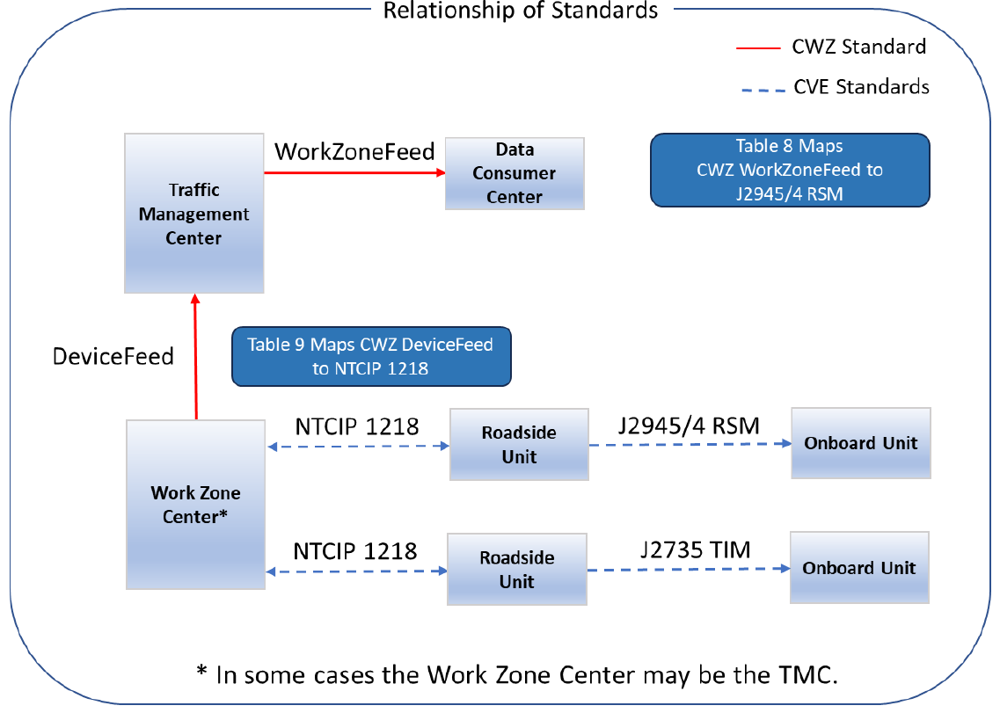
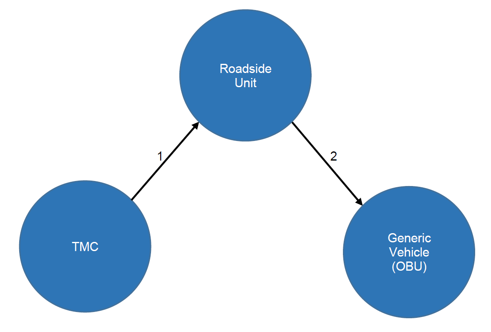

# **Annex C** 

# **Guidance for Deployments Involving Connected Vehicle Environment Work Zone-related Standards [Informative]** 

This annex provides guidance for CWZ deployers who may need to use this standard in addition to other standards related with the Connected Vehicle Environment. 

## **C.1 Physical Architecture – CVE Compatibility Roadside Safety Message** 

The figure below provides a context for the use of CWZ WorkZoneFeed and DeviceFeed together with other standards of the Connected Vehicle Environment. 

**Figure 5. Physical Architecture: Connected Vehicle Environment Roadside Safety Application** 

Note: Describing how to configure an RSU using NTCIP 1218 is out of scope of this project. 

## **C.2 Operational Scenario – CVE Compatibility Roadside Safety Message** 

| Scenario Item | Description |
|---|---|
|Title|Connected Vehicle Environment Compatibility–Roadside Safety Message|
|Problem Aspect|Work zone RSUs may provide messages using the connected vehicle environment standards to communicate with connected vehicle OBUs.|
|Description|The traffic management center may want to broadcast roadside safety messages to drivers in connected vehicles. This can be done with an RSU in the work zone. Possible messages may be a reduced speed zone warning or lane closure information.|
|Pre Conditions|<ul><li>The traffic management center is connected to the connected vehicle environment (C-V2X/DSRC/other).</li><li>The RSU is configured using communications standard NTCIP 1218.</li><li>The RSU is configured to broadcast the Roadside Safety Message per communications standard J2945/4.</li></ul>|
|Optional Diagram|  |
|Narrative and Sequence of Steps| 1. The TMC transmits an NTCIP 1218 message to the RSU to configure the RSU to send Roadside Safety Messages (RSM) to the OBU.  2. The RSU transmits an J2945/4 RSM message to the OBU.|
|End Conditions or State|CVs (OBUs in vehicles) receive Roadside Safety Message from the RSU so that the driver may be alerted.|

## **C.3 Design Guidance – WorkZoneFeed and SAE J2945/4 Compatibility** 

The information below is represents preliminary recommendations from the CWZ Working Group. 

**Table 8. Mapping of CWZ WorkZoneFeed Data Concepts to SAE J2945/4 Data Concepts** 

|**CWZ WorkZoneFeed Data Concept**|**SAE J2945/4 Data Concept** 3.5.1 Message Content and Structure Requirements|**Additional Information and Notes**|
|---|---|---|
|5.4 RoadEventFeature 5.4.1.1 id|3.5.2 Event Identification In this case the event is the work zone.||
|5.4.2.1 WorkZoneRoadEvent 5.4.2.3 RoadEventCoreDetails|3.5.3 Event Context||
|5.4.2.3 RoadEventCoreDetails 5.4.2.3.2 event_type|3.5.3.1 Event Type (Section G.2 Cause code)||
|work-zone detour|ITISGroup-Closures (3)||
|5.4.2.1 WorkZoneRoadEvent 5.4.2.1.18 types_of_work 5.4.2.7.1 type_name maintenance, minor-road-defect-repair, roadside-work, overhead-work below-road-work barrier-work surface-work painting roadway-relocation roadway-creation|3.5.3.2 Event Subtype (Section G.2 Subcause code) accident (513) closed-to-traffic (769) closed-ahead (771) closed-intermittently (772) closed-for-repairs (773) closed-for-the-season (774) blocked (775) blocked-ahead (776) reduced-to-one-lane (777) reduced-to-two-lanes (778) reduced-to-three-lanes (779) collapse (780) road-construction (1025) major-road-construction (1026) long-term-road-construction (1027) construction-work (1028)|A recommendation is provided in Annex D. There are challenges to providing a one-to-one mapping between the CWZ elements and those of SAE. The current state of the practice in some DOTs is to use a script that contains an algorithm to translate between the values shown in the columns at right. Currently, agencies have different and potentially conflicting approaches to expressing the information about a work zone using the SAE ITIS codes as described in the center column.|

|**CWZ WorkZoneFeed Data Concept**|**SAE J2945/4 Data Concept**|**Additional Information and Notes**|
|---|---|---|
||paving-operations (1029) work-in-the-median (1030) road-reconstruction (1031) opposing-traffic (1032) narrow-lanes (1033) construction-traffic-merging (1034) single-line-traffic-alternating-directions (1035) road-maintenance-operations (1036) road-marking-operations (1037) road-widening (1061)||
|5.4 RoadEventFeature 5.4.1.4 geometry|3.5.4 Event Location||
||Reference Point|No direct translation|
||Applicable Heading|Not a CWZ Standard data concept|
|5.4.1.4 geometry – LineString|Location Type = BroadPatch 5.2.24 DF_Path||
|| 3.5.5 Event Time||
|5.4.2.1.8 start_date|3.5.1.1 Event Start Time – Planned Event||
|5.4.2.1.8 start_date 5.4.2.1.10 is_start_date_verified|3.5.5.1.2 Event Start Time – Current Event|Potentially, 5.4.2.3.8 creation_date|
|5.4.2.1.9 end_date|3.5.5.2 Event End Time||
|5.4.2.1.16 reduced_speed_limit_kph Speed limit units are in kilometers per hour|3.5.12.2 Reduced Speed Event Requirements - Speed Limit Units in meters per second|Requires conversion between kilometer-per-second and meter-per- second|
|5.4.2.8 Lane|3.5.12.3 Lane Closure Event Requirements||
|5.4.2.8 Lane 5.4.2.8.1 order 5.4.2.8.2 status = open|3.5.12.3.1 Provide Number of Lanes Nominally Open||
|5.4.2.8 Lane 5.4.2.8.1 order 5.4.2.8.2 status = closed|3.5.12.3.2 Provide Indication of the Close Lanes||
|5.4.2.8 Lane 5.4.2.8.1 order|3.5.12.3.3 Provide Lane Closure Locations RSMLanePosition|There is direct alignment between the data concepts in both standards.|
|order. Integer. 1 = left most lane|- 5.5.7 DE_RSMLanePosition. Range||

|**CWZ WorkZoneFeed Data Concept**|**SAE J2945/4 Data Concept**|**Additional Information and Notes**|
|---|---|---|
||(1..32). 1 is the left most lane.||

A couple of noteworthy items are presented below: 

- The J2735 Sep 2023 version contains Section 5.17 Message: MSG_RoadSafetyMessage (RSM). The text in this section states that it is ‘Reserved for future use.’ The CWZ Working Group assumes that this section is a placeholder for the same RSM message as described in SAE J2945/4. 

- At the time of this writing, the CWG Working Group has learned that at least one organization, Ohio DOT, is developing a guide for usage of the J2945/4 RSM. 

## **C.4 Design Guidance – DeviceFeed and NTCIP 1218 Compatibility** 

The information below represents preliminary recommendations of the CWZ Working Group. 

**Table 9. Mapping of CWZ DeviceFeed Data Concepts to NTCIP 1218 Data Concepts** 

|**CWZ DeviceFeed Data Concept**|**NTCIP 1218 Data Concept**|**Additional Information and Notes**|
|---|---|---|
|5.5.2.13 RoadSideUnit|||
|5.5.2.1 FieldDeviceFeature|||
|5.5.2.1.4 geometry|5.7.6 GNSS Reported Latitude 5.7.7 GNSS Reported Longitude|Value = GeoJSON type ‘Point’|
|5.5.2.13.1 core_details|||
|5.5.2.2 FieldDeviceCoreDetails|||
|5.5.2.2.1 device_type||Value= ‘roadside_unit’|
|5.5.2.2.2 data_source_id||Determined by data provider|
|5.5.2.2.3 device_status||Determined by data provider|
|5.5.2.2.4 update_date||Determined by data provider|
|5.5.2.2.5 has_automatic_location||Value= ‘true’|
|5.5.2.13.2 message_types|5.4.2 Store and Repeat Table 5.4.2.2 Stored Message PSID|The Provider Service Identifier (PSID) is a reference to an application running on the roadside unit. The PSID may potentially be used to identify the type of message being broadcast by the RSU.|

## **C.5 Discussion – SAE J2735 Traveler Information Message** 

One key finding from discussions leading to development of this section by the CWZ Working Group is the need for a national effort or standard to ensure consistent usage and interoperability of J2735 TIM messages as they relate to work zones. 

- Currently,  several DOTs are independently developing guidance on the use and deployment of J2735 TIM messages These efforts include: 

   - Caltrans is developing a document titled “Connected Vehicle Traveler Information Guide.”  This guide aims  to specify how to configure the J2735 TIM message from ITIS Codes. 

      - The ITIS Codes can be linked to graphics/icons, some of which are already included in the MUTCD. 

      - The Caltrans guidance on J2735 TIM includes a mapping of ITIS Codes to the national MUTCD code, where applicable. 

   - Wyoming DOT (WyDOT) developed an early version of J2735 TIM message guidance as part of the Connected Vehicle Pilot Program. 

   - Colorado DOT has adopted and is following the guidance developed by WyDOT guidance. 

   - Michigan DOT actively broadcasts J2735 TIM from RSUs. 

