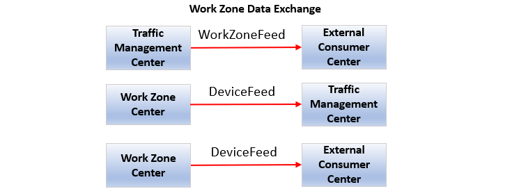
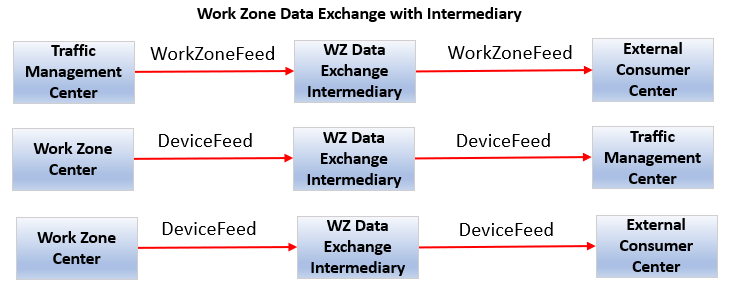
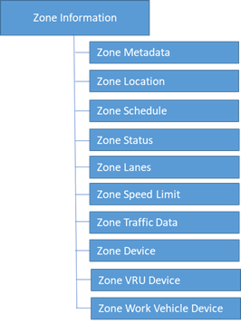
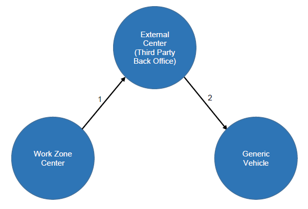
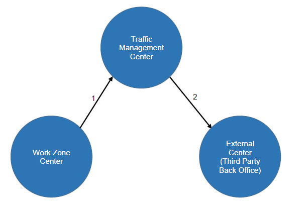
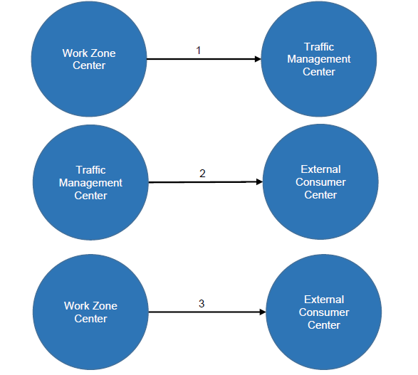
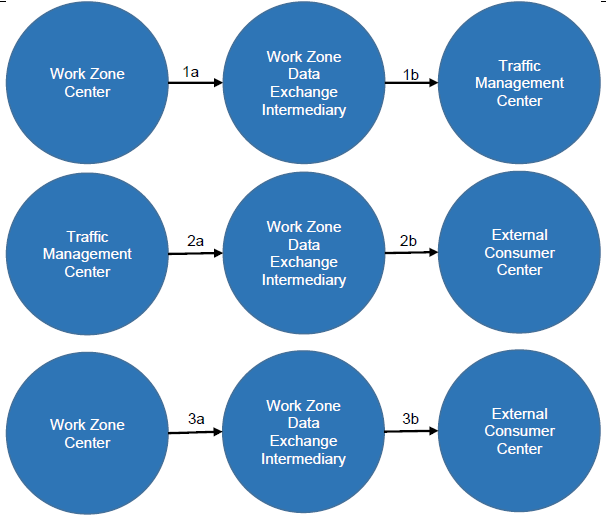
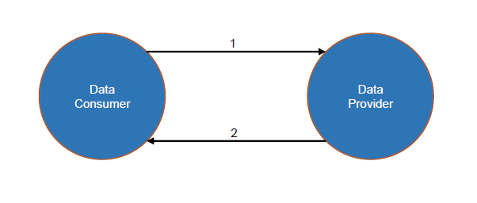
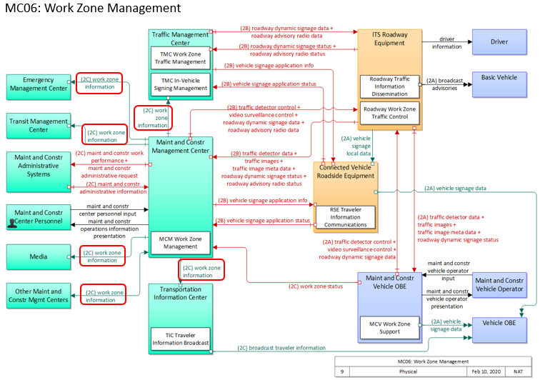

# 2 Concept of Operations (ConOps) \[Normative]

Section 2 defines the needs that subsequent sections of this CWZ Implementation Guide and Standard address. Accepted systems engineering processes detail that requirements should only be developed to satisfy well-defined needs. The first stage in this process is to identify the ways in which the CWZ system interface is intended to be used.

This concept of operations provides the reader with the following:

* A detailed description of the scope (or problem statement) covered in this CWZ Implementation Guide and Standard document;
* the key capabilities and interfaces for a connected work zone;
* the relationship to the Architecture Reference for Cooperative and Intelligent Transportation (ARC-IT).

Section 2 is intended for all readers and users of the CWZ Implementation Guide and Standard, including the following:

* **Transportation Managers.** Personnel responsible for making decisions about transportation strategies to implement connected work zones.
* **Transportation Operators.** Personnel responsible for monitoring connected work zones and implementing transportation strategies to address the impacts on travel stemming from work zones.
* **Transportation Engineers.** Personnel responsible for the design and engineering of connected work zones.
* **Maintenance Personnel.** Personnel responsible for ensuring that connected work zones are maintained as intended.
* **Data Consumers.** Personnel at organizations, where the organization consumes connected work zone information and provides additional value based on that information.
* **Data Aggregators, Providers, and Distributors.** Personnel at organizations, where the organization gathers and aggregates connected work zone information, adds value, and distributes the work zone information.
* **System Integrators.** Entities that bring together different components or subsystems into a whole system that functions together.
* **Application Developers.** Developers providing applications that rely on data exchanges between CWZ component actors, whether work zone vulnerable road users, work zone field devices, work zone work vehicles, or work zone centers; and applications that exchange work zone information from a connected work zone and other centers, with a cloud service or back-office location.
* **Temporary Traffic Control Contractor.** A contractor, and possibly the equipment supplier (rental agency), responsible for deploying and maintaining equipment including the connectivity aspects of the equipment, and between the field and vehicle.

## 2.1 Tutorial \[Informative]

A concept of operations describes a proposed system from the users' perspectives. Typically, a concept of operations is used to ensure that system developers understand the users' needs. However, for the purposes of this system interface standard we will use the term "user" to mean one or more system components of a CWZ, with the intent of describing representative examples of benefits that may arise for human end-users.

The terms "Normative" and "Informative" are used to distinguish parts of this ConOps that must be conformed to (Normative) and those that are there for informational purposes (Informative). It is possible for a section to be identified as Normative but have subsections that are identified as Informative. If a section is Normative then all of its subsections are Normative unless identified otherwise. This entire ConOps section is Normative unless otherwise indicated.

The concept of operations starts with a discussion of the current situation and issues that have led to the

need to develop CWZ implementation guidance and a data exchange standard to enable interoperable connected work zones. This discussion is presented in layman's terms such that both the potential users of the system and the system developers can understand and appreciate the situation.

The concept of operations then documents key aspects about the proposed system, including the following:

* **Reference Physical Architecture.** The reference physical architecture (view) defines the overall context of a connected work zone system and defines what component actors and interfaces are addressed by this CWZ Standard \& Implementation Guide.
* **Needs.** The needs identify and describe the interfaces and data exchanges that users may require to achieve some benefit. These needs address a specific aspect of the problem statement (Section 2.2). The needs are structured and organized into a more manageable format that forms the basis of the traceability table that relates needs to the functional requirements contained in Section 3.
* **Operational Scenarios.** The operational scenarios allow a reader to understand the different parts and functions of a CWZ. An operational scenario explains how the component actors of a CWZ interact to enable the benefits of deploying connected work zones using this standard. The operational scenarios are representative examples illustrating interactions between component actors of a CWZ.
* **Operational Policies and Constraints.** A narrative description of specific policies or constraints relative to the operational environment that have a direct impact on the deployment of connected work zones using this CWZ Implementation Guide.
* **Relationship to the National ITS Architecture Reference.** This section describes how the elements of a CWZ are described by the National ITS Architecture Reference (ARC-IT).

Section 3 applies the needs identified in the ConOps to define the interface requirements for a CWZ. Each need traces to one or more requirements, and each requirement is derived from at least one need. This traceability is documented in a Protocol Requirements List (PRL) in Section 3.10, where each need is mapped to all the corresponding requirements.

Like the needs, the requirements are identified by broad stakeholder collaboration. Each requirement is captured in Section 3 as a formal "shall" statement. Each requirement is then presented in the Requirements Traceability Matrix (RTM) in Annex A, which defines how the requirement is fulfilled by a design element.

## 2.2 Current Situation and Problem Statement \[Informative]

Work zone safety is of utmost concern to transportation agencies. According to the National Highway Traffic Safety Administration, in 2020 there were 857 fatalities and an estimated 102,000 work zone crashes in the United States. There have been numerous research projects, deployments, and standards development to support work zone safety, but there have been inconsistencies with the interpretations and implementation of the existing standards and in the use and expectations of data exchanges. There are also inconsistencies between deployments, such as usage of different data and data formats across interfaces, and security requirements. Another discovery was that most infrastructure owner operators (IOOs) do not have the manpower or technical knowledge to properly deploy and operate connected work zones. These deployment issues highlight a need for an industry standard that enables national interoperability and provides guidance for how to deploy, operate, and maintain connected work zones.

## 2.3 Reference Physical Architecture \[Informative]

### 2.3.1 Connected Work Zone Physical Architecture

This section presents an overview of the actor components that make up the CWZ Architecture as defined for this document. Two figures are presented to accommodate various deployment needs. While the two diagrams may be combined, we provide them separately for clarity. Please note that the two diagrams are consistent and can be mixed and matched depending on the deployment's needs.

Figure 1 illustrates the sharing of WorkZoneFeed and DeviceFeed information without the use of a Work Zone Data Exchange Intermediary.

Note: The term "actor component," as used in this context and shown as a rectangle in the diagram, is a computing device and does not represent a person or stakeholder. An actor component is the end point of a data interface between computing devices with the purpose of exchange of work zone data. Our intent is to specify an architecture for data exchanges that communicate information between computing devices, whether in centers, in vehicles, in field devices, or on people.

Figure 1. Physical Architecture: Work Zone Data Collection and Distribution

Figure 2. Physical Architecture: Work Zone Data Collection and Distribution with Intermediary

Figures 1 and 2 above are not intended to identify every combination of information exchanges between actor components involving WorkZoneFeeds and DeviceFeeds. There are potentially many other reasonable combinations; for example, Traffic Management Centers may blend the device feed information with other work zone information resulting in a work zone feed. This is illustrated in Operational Scenario 2.6.3 later in this document.

Definitions for WorkZoneFeed and DeviceFeed are presented below:

* **WorkZoneFeed**. Provides high-level information about events on roadways related to work zones that impact the characteristics of the roadway and involve a change from the default state (e.g., a lane closure).
* **DeviceFeed**. Provides information (location, status, dynamic data) about field devices deployed on the roadway in work zones.

The following sections describe the actor components that interact to provide the benefits of a CWZ:

**Primary Actors.** Communications with these actors as defined in this standard is generally in-scope.

* **Traffic Management Center.** A center, typically managed by an IOO, that tracks (collects) status and conditions, and distributes Work Zone Information.
* **Work Zone Center.** A center that directly collects information from Work Zone Field Devices, Work Zone VRUs, and Work Zone Work Vehicles to generate a composite view of the status and conditions of a work zone. Data may be collected from equipment in the work zone or entered manually by a person.
* **External Center.** A center, whether virtual, mobile, or stationary, interacting with a Traffic Management Center or Work Zone Center. Typically used to describe a Third-Party Center, such as a back-office or cloud.
* **Work Zone Data Exchange Intermediary.** A center that collects, aggregates, stores, and distributes work zone information on behalf of other centers.

**Peripheral Actors.** Communication with these actors is generally outside the scope of this standard.

* **Work Zone Devices.**
* **Work Zone Field Device.** Devices and electronic systems that monitor and affect work zone operations on a roadway. Examples include arrow boards, location marker devices, and roadside units (for connected vehicle environments), among others. This may include a hub field device master that communicates with other equipment in the work zone.
* **Work Zone Vulnerable Road User Device.** Devices worn by persons at risk of harm within or near an active roadway, such as a work zone.
* **Work Zone Work Vehicle Device.** Devices in work vehicles within or near an active roadway, such as a work zone. Examples may include maintenance vehicles, construction vehicles, attenuator vehicles, or in some cases, first responder vehicles in a work zone.
* **Generic Vehicle.** A vehicle (e.g., passenger vehicle, van, bus, or truck) traveling through a connected work zone but not responsible for any activities within it.

## 2.4 Tutorial – Data Exchange Roles and Mechanisms \[Informative]

### 2.4.1 Data Exchange Roles

CWZs have multiple actors as described in the prior section. For any particular set of data exchanges there are actor roles that need to be defined to accomplish data exchanges.

* Data Provider Role. A data provider is an actor component that has data and is able to provide that data through a defined communications interaction with another actor component that needs and is able to consume that data.
* Data Consumer Role. A data consumer is an actor component that needs data and can acquire and consume it through a defined communication interaction with another actor component that provides the necessary data.
* Data Exchange Intermediary Role. An actor component that serves as both a data provider and a data consumer. For example, an actor that collects data (consumer), aggregates it, and then distributes it (provides).

### 2.4.2 Data Exchange Mechanism

For the purposes of this CWZ ConOps, we will define a polling data exchange mechanism as follows:

* Polling is a communications interaction between system actors where a data consumer system initiates the data exchange with a request for information. Upon request, the data provider system sends information to the data consumer system.

### 2.4.3 Communications Interactions in Lay Terms

Polling is a way for a data consumer to request data from a data provider.

The following scenario describes this human interaction, with Chris as the data consumer, and Paula as the data provider.

Chris walks up to a counter where Paula is standing behind the counter. Chris presents Paula with a slip of paper (let's call this an authentication) with Chris's name on it. Paula looks at the piece of paper, nods in approval, and then retrieves a three-ring binder with 500 pages of information (one for each work zone, representing all work zone activities within the state of Florida. The binder serves as a metaphor for a complete set of work zone data at a specific point in time.

Chris asks how often Paula can provide updates, and let's say Paula states she is able to do so every five minutes. With polling, this exchange—where Chris presents a slip of paper and receives a three-ring binder (a single poll)— repeats continuously. Within a 24-hour period, Chris polled 288 times, and Paula provided 288 binders.

One example use of the polling method is the General Transit Feed Specification (GTFS).

## 2.5 Needs

The needs for a connected work zone are organized as follows:

* **Architectural Needs.** These needs identify and describe the various interactions between component actors in a CWZ system, as well as higher-level needs that apply to all actors and most, if not all, interactions.
* **Data Exchange Needs.** These needs describe data exchanged between actors, where one or more actors serve as data provider or consumer. Please note that the roles of data provider and data consumer may change depending on the specific need. These data exchange needs also reflect data content needs.

### 2.5.1 Architectural Needs

This section, outlining the architectural needs of CWZs, is organized into sub-sections as follows:

* Backward Compatibility
* GeoJSON Data Exchange \[Constraint]
* GeoJSON Data Format \[Constraint]
* GeoJSON Data Validation
* Frequency of Data Updates
* UTC Date-Time Format \[Constraint]

Note: The term "CWZ Deployer" is used sparingly throughout Section 2.5 (Needs) when neither a data provider nor data consumer can be identified as an actor. This happens, for example, in the description of the architectural needs below.

#### 2.5.1.1 Architectural Need - Compatibility with the WZDx Specification

CWZ deployers need to describe and implement a mechanism to support compatibility with the design elements specified in WZDx v4.2.

#### 2.5.1.2 Architectural Need - GeoJSON Data Exchange \[Constraint]

##### 2.5.1.2.1 GeoJSON Data Exchange. Poll for Data \[Constraint]

CWZ deployers need to share the current status of work zone information in the GeoJSON data format. Poll for Data is a synchronous method of data communications.

#### 2.5.1.3 Architectural Need. GeoJSON Data Format \[Constraint]

CWZ deployers must continue using the GeoJSON data format (as applied in the WZDx specification). A JSON schema is used to describe the GeoJSON format and can also validate the conformance of work zone data to the specification described in the JSON schema

Feedback from CWZ deployers indicates that the JSON schema and GeoJSON data format work well, as follows:

* The GeoJSON data format provides a framework to support the geospatial information value chain.
* The GeoJSON data format works well for high-bandwidth communications (e.g., internet connections).
* The GeoJSON data format provides outputs that support data visualization. For example, the data can be used with off-the-shelf GIS tools directly "out of the box.

#### 2.5.1.4 Architectural Need. GeoJSON Data Validation \[Constraint]

CWZ deployers need to verify conformance of work zone data against the design. Currently, the verification of work zone data (e.g., a WZDx WorkZoneFeed) is accomplished using off-the-shelf software that verifies the work zone data against the specification's JSON Schema.

#### 2.5.1.5 Architectural Need. Frequency of Data Updates

CWZ data providers use the frequency of updates time to reflect how often real-time work zone condition information is made available.

CWZ data consumers need to know the frequency of work zone data updates when new information is available.

#### 2.5.1.6 Architectural Need. UTC Date-Time Format Specification \[Constraint]

CWZ deployers need to exchange date-time data in a standardized format.

CWZ deployers need to continue using the UTC Date-Time format specification.

### 2.5.2 Data Exchange Needs

This section introduces the terms "zone" and "project." A zone describes a section of roadway where VRUs, vehicles, and devices are present. A zone will generally have consistent characteristics throughout the section of roadway. A project may include one or more zones to represent varying roadway characteristics that change across space and/or time.

This section states the data exchange needs between CWZ actor components and is organized into the following sub-sections:

* Zone Metadata
* Zone Location
* Zone Schedule
* Zone Status
* Zone Lanes
* Zone Speed Limit
* Zone Traffic Data
* Zone Device
* Zone Vulnerable Road User (VRU) Device
* Zone Work Vehicle Device

The diagram below provides a high-level visual interpretation of these sections, which together represent the data exchange needs of connected work zones. The diagram is not intended as a schematic representation for software, application, or database design.

Figure 3. Data Exchange Needs – Zone Information Organization

#### 2.5.2.1 Zone Metadata

CWZ data providers need to provide metadata about work zone information to data consumers. Metadata may support the need for data discovery and may provide information about the data's provenance, trustworthiness, and chain of custody.

##### 2.5.2.1.1 Zone Metadata – Zone Data Standard Version

CWZ data providers need to provide the version of the standard so that data consumers can identify and support multiple versions.

##### 2.5.2.1.2 Zone Metadata – Zone Identifier

###### 2.5.2.1.2.1 Support Zone Identifier for Zones

CWZ data providers need to include the zone identifier when providing work zone information to data consumers.

###### 2.5.2.1.2.2 Support Unique Zone Identifiers

CWZ deployers need zone identifiers that uniquely identify each zone.

###### 2.5.2.1.2.3 Support Unique Zone Group Identifiers

CWZ deployers need unique zones group identifiers to group zones within the same project.

###### 2.5.2.1.2.4 Support Zone Identifiers for VRUs, Devices, Work Zone Vehicles, Lanes, and Speed Limit Zones

CWZ deployers need to associate VRUs, devices, work vehicles, lane configurations, speed limit zones, etc., with a uniquely identifiable zone or group of zones comprising a project.

##### 2.5.2.1.3 Zone Metadata – Zone Activity Type

CWZ data providers need to specify the activity type present within a zone when providing work zone information to data consumers. Activity types may include: repair of spring cracks, pothole repairs, striping, mowing, guard rail repairs, repaving, construction, etc.

##### 2.5.2.1.4 Zone Metadata – Zone Data Timestamp

CWZ data providers need to include a timestamp reflecting the creation time of the zone data when providing work zone information. Data consumers need this timestamp to assess the age, accuracy, and reliability of the data.

##### 2.5.2.1.5 Zone Metadata – Zone Data Source

CWZ data providers need to provide data consumers with a data source identifier that indicates the original source of the data and most recent source of updates.

#### 2.5.2.2 Zone Location

##### 2.5.2.2.1 Zone Location – Geometry

CWZ deployers want to notify/alert distracted drivers ahead of their arrival at the work zone so that they can travel safely through the zone.

CWZ data providers need to provide zone location geometry when providing work zone information to data consumers.

#### 2.5.2.3 Zone Schedule

##### 2.5.2.3.1 Zone Schedule – Date-Times

CWZ data providers need to provide data consumers with the date and times when a work zone is scheduled to be active. .

#### 2.5.2.4 Zone Segmentation

##### 2.5.2.4.1 Zone Segmentation – Geometry

CWZ data providers need to provide zone geometries that correspond to a roadway segment with consistent zone characteristics (including, but not limited to road name, direction, lanes closed, start or end location). If characteristics vary along a section of roadway, CWZ data providers need to represent the area as multiple related zones.

##### 2.5.2.4.2 Zone Segmentation – Date-Times

CWZ data providers need to provide zone schedules that correspond to roadway segments with consistent zone characteristics, such as road name, direction, lanes closed, and start or end time. If characteristics vary during the work period. CWZ data providers need to represent the work as multiple related zones with distinct schedules.

#### 2.5.2.5 Zone Status

##### 2.5.2.5.1 Zone Status – Is Active

One of the biggest challenges for CWZ data providers is determining when the active work is actually occurring. Knowledge of planned activity is generally unreliable and insufficient to satisfy the timeliness requirements of safety applications.

CWZ data providers need to indicate when a work zone is active when providing work zone information to data consumers.

#####  2.5.2.5.2 Zone Status – Length

CWZ deployers manage work zone activities that can stretch across long distances, sometimes up to 60 miles.

CWZ data providers need to specify the zone length when providing work zone information to work zone data consumers.

#####  2.5.2.5.3 Zone Status – Number of Lanes Open

CWZ data providers need to indicate the number of lanes open (available for traffic) when providing work zone information to work zone data consumers.

#####  2.5.2.5.4 Zone Status – Ad-hoc (Unscheduled/Unplanned)

Some work zones are dynamic, arising without prior notice and lasting for short durations.

CWZ data providers need to provide information for ad-hoc work zones when providing work zone information to work zone data consumers.

##### 2.5.2.5.5 Zone Status – Is Rolling/Moving

Many work zones are dynamic, without a fixed location, and move continuously over time. Examples include work zones for mowing, striping operations, and repaving.

CWZ data providers need to provide information for rolling/moving work zones when providing work zone information to work zone data consumers.

#### 2.5.2.6 Zone Lanes

##### 2.5.2.6.1 Zone Lanes – Numbering and Identification

###### 2.5.2.6.1.1 Lane Information

CWZ deployers have identified the need to report information for every lane affected by construction or maintenance in a work zone.

###### 2.5.2.6.1.2 Lane Numbering Is Left-to-Right or Right-to-Left

CWZ deployers have identified the need for a nationally consistent method of lane numbering.

CWZ data providers must specify the lane numbering method, including whether lanes are numbered left-to-right or right-to-left, as well as the starting number for the first lane, when providing work zone information to work zone data consumers.

##### 2.5.2.6.2 Zone Lanes – Lane Type

CWZ data providers must use standardized titles for lane types when providing work zone information to work zone data consumers. For example, they must specify if a lane is a shoulder, drivable, or a special-use lane.

###### 2.5.2.6.2.1 Zone Lanes – Lane is Drivable

CWZ data providers need to indicate whether a lane is drivable when providing work zone information to work zone data consumers.

###### 2.5.2.6.2.2 Zone Lanes – Special Use

CWZ data providers need to indicate whether a lane is designated for special use when providing work zone information to work zone data consumers.

###### 2.5.2.6.2.3 Zone Lanes – Reversible Lane

CWZ data providers need to identify whether a lane is reversible, including its status, and direction, when providing work zone information to work zone data consumers. When a lane is reversible, lane numbering that is normally left-to-right becomes right-to-left.

##### 2.5.2.6.3 Zone Lanes – Connected Vehicle Environment Roadside Safety Applications

CWZ deployers developing applications for the connected vehicle environment may require detailed geometry attributes assigned to each node per lane in a work zone to account for road curvature. This need specifically supports the generation of MAP messages for CV applications. Example of deployers with this need include connected vehicle applications, CV pilots, and CV research projects.

CWZ data providers need to provide zone lane-level geometry when providing work zone information to work zone data consumers.

##### 2.5.2.6.4 Zone Lanes – Lane Tapers

CWZ deployers need to identify lane tapers. CWZ deployers have referenced the MUTCD and determined that tapers should be developed based on roadway speed.

CWZ deployers using vehicles with driver assist functionality must navigate a work zone taper, and need to know the taper start/end points, the direction of lane change left/right, and the number of lanes to change.

###### 2.5.2.6.4.1 Taper Start and End Positions, Direction of Taper, and Number of Lanes to Taper

CWZ data providers need to provide lane taper information, including start location, end location, direction (left-to-right or right-to-left), and the number of lanes to taper when providing work zone information to work zone data consumers.

##### 2.5.2.6.5 Zone Lanes – Lane Closure Status

CWZ data providers need to indicate whether a lane is open or closed when providing work zone information to work zone data consumers.

#### 2.5.2.7 Zone Speed Limit

CWZ deployers need real-time updates about speed limits in work zones, including the start and end points, and speed limit reductions in effect.

##### 2.5.2.7.1 Zone Speed Limit – Positions/Geometry

CWZ data providers need to provide speed limit zone geometry, including start and end points of speed limit changes, when providing work zone information to work zone data consumers.

##### 2.5.2.7.2 Zone Speed Limit – Speed Limit Change

CWZ data providers need to provide speed limit changes when providing work zone information to work zone data consumers.

#### 2.5.2.8 Zone Traffic Data

CWZ deployers need to develop and maintain historical work zone traffic data for later data analysis about work zones.

##### 2.5.2.8.1 Zone Traffic – Speed, Volume, and Occupancy

CWZ deployers may deploy devices to capture information about traffic speed, volume, and occupancy.

CWZ data providers need to provide information on traffic speed, volume, and occupancy for vehicles traveling through the work zone to work zone data consumers.

##### 2.5.2.8.2 Zone Traffic – Queue Warning

CWZ data providers need to issue queue warnings for work zone data consumers entering a work zone when providing work zone information to work zone data consumers.

#### 2.5.2.9 Zone Device

##### 2.5.2.9.1 Zone Device – Inventory and Status

CWZ deployers send alerts to devices such as flashing beacons to work zone VRUs and drivers traveling through work zones.

CWZ data providers need to provide information about device inventory, availability, and status when providing work zone information to data consumers.

CWZ deployers need information about devices deployed in work zones, including:

* Device type
* Device location
* Device status

##### 2.5.2.9.2 Zone Device – Location Marker Type

CWZ deployers use location marker devices to identify and broadcast various work zone attribute locations, such as start and end points of work zone approaches, VRUs, taper zones. and speed limit reduction zones.

CWZ data providers need to provide location marker type and position when providing work zone information to data consumers.

##### 2.5.2.9.3 Zone Device – Device Type

CWZ data providers need to specify the device type when providing work zone information to work zone data consumers.

Representative examples of zone device types include the following:

* Arrow Boards
* Cameras
* Portable Message Signs
* Speed Limit Signs
* Speed Feedback Signs
* Location Markers
* Roadside Units

##### 2.5.2.9.4 Zone Device – Position/Geometry

CWZ data providers need to provide the location or geometry of each device when providing work zone information to work zone data consumers.

##### 2.5.2.9.5 Zone Device – Device Status

CWZ data providers need to provide the status of each device when providing work zone information to work zone data consumers.

##### 2.5.2.9.6 Zone Device – Zone Identifier

CWZ data providers need to provide the zone identifier and/or project identifier associated with each work zone device when providing work zone information to work zone data consumers.

#### 2.5.2.10 Zone Vulnerable Road Users (VRU) Device

##### Zone VRU Device – Worker Presence Status/Activity

The requirements contained in this section may be generalized to apply to VRUs, a superset of work zone workers.

CWZ deployers have identified a mission-critical need to absolutely identify in real-time whether workers are present in a work zone. For example, an OEM may allow the autodrive feature on a vehicle to stay active if no workers are present, but if workers are detected, the OEM may return control of the vehicle to the driver.

CWZ data providers need to provide real-time indications of workers presence in the work zone when providing work zone information to work zone data consumers.

##### Zone VRU Device – Position/Geometry

The requirements in this section include work zone workers, a subset of VRUs.

CWZ deployers need to address real-time VRU presence identification. This includes:

* Providing a geographic description of an area within a work zone where VRUs are present.
* Providing a point location to describe where workers are present, such as when a worker is wearing a vest with electronics that determine the VRU's position/location.

CWZ deployers need VRU location information.

CWZ data providers need to provide real time indication of areas within the work zone where VRUs are present when providing work zone information to work zone data consumers.

CWZ data providers need to provide real time indication of VRU position/location where VRUs are present when providing work zone information to work zone data consumers.

#### 2.5.2.11 Zone Work Vehicle Device

CWZ deployers need to know the real-time position and location of work vehicles in the work zone. CWZ deployers state that vehicles in a work zone present a hazardous condition. Generally, vehicle types for which location is needed to be shared includes:

* Attenuator vehicles
* Construction vehicles
* Maintenance vehicles
* Emergency vehicles
* Stalled or disabled vehicles

##### 2.5.2.11.1 Zone Work Vehicle Device – Vehicle Type

CWZ data providers need to provide the work vehicle type when providing work zone information to work zone data consumers. Work vehicle types include: attenuator vehicles, construction vehicles, maintenance vehicles, emergency vehicles, and stalled or disabled vehicles.

##### 2.5.2.11.2 Zone Work Vehicle Device – Vehicle Position

CWZ data providers need to provide the location or position of work vehicles when providing work zone information to work zone data consumers. Work vehicles parked or stalled near travel lanes present a hazard.

## 2.6 Operational Scenarios \[Informative]

A scenario is a step-by-step description of how the proposed set of system interfaces should operate under specific conditions. Operational Scenarios help readers understand how all the components of a system interact to provide operational capabilities. \[Adapted from IEEE 1362-1998]

For the purposes of this project, the proposed system is a connected work zone. The operational scenarios allow a reader to understand the different component actors of a CWZ, proposed functions, and data exchanges under a given set of conditions. Pre-conditions are outlined , and a narrative guides the reader through the sequence of events and data exchanges, concluding with a desired end state or condition.

These are intended to illustrate representative examples of interactions between component actors. They are not intended to be all-encompassing.

Table 1. Operational Scenario Template

| Scenario Item | Description |
|---|---|
| Title | Operational Scenario Title. Shortest possible problem statement, and usually stating the desired end-condition. |
| Problem Aspect | Some situation of concern, for example Work Zone Vulnerable Road User and Driver Safety. |
| Description | A description of the scenario. For example, the purpose of this scenario is to provide advisories, warnings, or alerts to drivers. |
| Pre Conditions | A listing of factors, attributes, or measures about the environment/conditions describing the beginning state of the operational scenario. |
| Optional Diagram | A sequence diagram showing actors and a numbered sequence of interactions and events to demonstrate how to transition from pre-condition to end-condition states. |
| Narrative and Sequence of Steps | 1. A numbered narrative that usually describes the steps shown in the sequence diagram. |
| End Conditions or State | Everyone safe! A listing of factors, attributes, or measures describing the final state of the environment or conditions for the operational scenario. |

### 2.6.1 Ad-hoc Notification of Work Zone Ahead

| Scenario Item | Description |
|---|---|
| Title | Ad-hoc Notification of Work Zone Ahead |
| Problem Aspect | Work zones may want to provide advanced notification of their presence to vehicles. |
| Description | The work zone may want to provide advanced notification to vehicles of its presence. This can be achieved with the cooperation of a third party, such as an OEM or a smartphone navigation application. Some deployers refer to this as ad-hoc. |
| Pre Conditions | <ul><li>The work zone location is known by the Work Zone Center.</li><li>The Work Zone Center is connected to an External Center with vehicle notification capabilities.</li><li>In this scenario, a Traffic Management Center (TMC) does not know about this work zone (ad-hoc).</li></ul> |
| Optional Diagram |  |
| Narrative and Sequence of Steps | <ol><li>The Work Zone Center sends work zone information (DeviceFeed) to an External Center.</li><li>The External Center provides the work zone ahead notification to a Generic Vehicle (proprietary).</li></ol> |
| End Conditions or State | The driver of the Generic Vehicle is notified of the work zone ahead through their smartphone navigation app or vehicle notification system. |

### 2.6.2 IOO Notification of Work Zone Information

| Scenario Item | Description |
|---|---|
| Title | IOO Notification – Work Zone Information |
| Problem Aspect | Work zones may want to share advanced notification of their presence to external centers. |
| Description | The IOO may want to provide advanced notification to External Centers of the presence of a work zone. |
| Pre Conditions | <ul><li>The work zone location is known by the Work Zone Center.</li><li>The work zone center is connected to a Traffic Management enter, which assigns an IOO work zone identifier.</li></ul> |
| Optional Diagram |  |
| Narrative and Sequence of Steps | <ol><li>The Work Zone Center sends work zone information (DeviceFeed) to a Traffic Management Center.</li><li>The Traffic Management Center forwards the work zone information to an External Center.</li></ol> |
| End Conditions or State | The External Center has received notification of work zone information. |

### 2.6.3 Work Zone Data Collection and Distribution

| Scenario Item | Description |
|---|---|
| Title | Work Zone Data Collection and Distribution |
| Problem Aspect | Work zone actors may wish to communicate data with each other. |
| Description | Collection and distribution of work zone and device information. |
| Pre Conditions | <ul><li>The Work Zone Center, Traffic Management Center, and External Consumer Center are connected for communication of data.</li></ul> |
| Optional Diagram |  |
| Narrative and Sequence of Steps | 
1) The Work Zone Center sends the DeviceFeed for all devices managed by the Work Zone Center. Each device ID is assigned a UUID by the Work Zone Center.

2) The Traffic Management Center assigns a unique work zone ID in the WorkZoneFeed. The Traffic Management Center matches the device IDs to their work zone IDs to determine device status, i.e., an arrow board is active, and therefore the work zone is active. The Traffic Management Center forwards the WorkZoneFeed information to an External Consumer Center.

3) Work Zone Center sends the DeviceFeed to the External Consumer Center.
 |
| End Conditions or State | The Traffic Management Center and External Consumer Center have up-to-date information about work zones and their conditions. |

### 2.6.4 Work Zone Data Collection and Distribution (Data Exchange Intermediary)

| Scenario Item | Description |
|---|---|
| Title | Work Zone Data Collection and Distribution (Intermediary) |
| Problem Aspect | Work zone actors may wish to communicate through an intermediary. |
| Description | Collection and distribution of work zone and device information via an intermediary system. |
| Pre Conditions | <ul><li>The Work Zone Center, Traffic Management Center, and External Consumer Center are connected to the Work Zone Data Exchange Intermediary for communication of data.</li></ul> |
| Optional Diagram |  |
| Narrative and Sequence of Steps | 
1a) The Work Zone Center sends device information for all devices it manages (DeviceFeed) to a Work Zone Data Exchange Intermediary. Each device ID has a UUID, assigned by the Work Zone Center.

1b) The Work Zone Data Exchange Intermediary sends information (DeviceFeed) to the TMC.

2a) A work zone ID is unique, assigned by the Traffic Management Center in the WorkZoneFeed. The Traffic Management Center matches the device status, i.e., an arrow board is active, and therefore the work zone is active. The Traffic Management Center sends information to the Work Zone Data Exchange Intermediary (WorkZoneFeed).

2b) The Work Zone Data Exchange Intermediary sends information to an External Consumer Center (WorkZoneFeed).

3a) The Work Zone Center sends all device data (DeviceFeed) to the Work Zone Data Exchange Intermediary.

3b) The Work Zone Data Exchange Intermediary forwards the DeviceFeed to the External Consumer Center.
 |
| End Conditions or State | The Traffic Management Center and External Consumer Center have up-to-date information about work zones and their conditions. |

### 2.6.5 Generic Work Zone Information Data Exchange (Poll for Data)

| Scenario Item | Description |
|---|---|
| Title | Generic Work Zone Information Data Exchange (Poll for Data) |
| Problem Aspect | A Data Consumer (a CWZ component actor) requires current up-to-date information from a Data Provider (another CWZ component actor). |
| Description | When a Data Consumer requires current information from a Data Provider, whether as an update or to establish a baseline of information, the Data Consumer polls the data provider to ensure the data is current. |
| Pre Conditions | <ul><li>The Data Consumer has an authorized connection to the Data Provider.</li></ul> |
| Optional Diagram |  |
| Narrative and Sequence of Steps | <ol><li>The Data Consumer sends a request for information to the Data Provider.</li><li>The Data Provider responds with the requested information.</li></ol> |
| End Conditions or State | The Data Consumer has current and accurate information about work zones and conditions. |

## 2.7 Operational Policies and Constraints

The following operational policies and constraints apply to the use of this CWZ Implementation Guide and Standard document.

### 2.7.1 Operational Policies and Constraints – Manual of Uniform Control Devices (MUTCD)

The operation and maintenance of connected work zones are governed by the regulatory guidelines or policies established by the operating agency (IOO). These may include the USDOT's and relevant states' Manual of Uniform Traffic Control Devices (MUTCD), as well as state and local ordinances, policies, and procedures.

### 2.7.2 Operational Policies and Constraints – Security

The operation and maintenance of connected work zone information and system security are governed by the regulatory guidelines and policies of the data provider.

### 2.7.3 Operational Policies and Constraints – Uniform Resource Identifiers

The operation and maintenance of connected work zone information and websites, including the determination of uniform resource identifiers, are governed by the regulatory guidelines and policies of the data provider.

### 2.7.4 Operational Policies and Constraints – Universally Unique Identifiers (UUIDs)

The assignment of UUIDs is governed by the regulatory guidelines and policies of the data provider. For example, policies to guarantee privacy may dictate the assignment of uniform resource identifiers may necessitate changes to UUIDs over time. Likewise, data consumers may need to specify the need for UUIDs to remain consistent across time.

## 2.8 Relationship to the Architecture Reference for Cooperative and Intelligent Transportation \[Informative]

This section describes how portions of the Architecture Reference for Cooperative and Intelligent Transportation, known as ARC-IT, are addressed by this CWZ Implementation Guide and Standard.

At the highest level of abstraction, the physical architecture consists of center components, field components, vehicle components, and personal components. ARC-IT defines these components as follows:

* **Center.** An entity that provides application, management, administrative, and support functions from a fixed location not in proximity to the road network. The terms "back office" and "center" are used interchangeably. "Center" is traditionally a transportation-focused term, evoking management centers to support transportation needs, while "back office" generally refers to commercial applications.
* **Field.** These are intelligent infrastructure elements distributed near or along the transportation network which perform surveillance (e.g., traffic detectors, cameras), traffic control (e.g., traffic signal controllers), information provision (e.g., dynamic message signs) and local transaction (e.g., tolling, parking) functions. Typically, their operation is governed by transportation management functions running in back offices. Field components also include RSU, LTE-CV2X, and other non-Dedicated Short Range Communication (DSRC) wireless communications infrastructure that provides communications between mobile elements and fixed infrastructure.
* **Personal.** Equipment used by travelers to access transportation services both pre-trip and enroute. This includes mobile/handheld devices as well as desktop equipment owned and operated by the traveler.
* **Vehicle.** Vehicles, including driver information and safety systems applicable to each vehicle type.

Service Packages and associated diagrams show the key interfaces and flow of information exchanged between components. The service package in ARC-IT that best identifies the scope of Connected Work Zones is MC06: Work Zone Management.

### ARC-IT Work Zone Management Service Package

MC06: Work Zone Management. This service package manages work zones by controlling traffic in areas of the roadway where maintenance, construction, or utility work activities are underway. Traffic conditions are monitored using CCTV cameras and controlled using dynamic message signs (DMS), Highway Advisory Radio (HAR), gates, and barriers. Work zone information is coordinated with other groups (e.g., traveler information, traffic management, other maintenance and construction centers). Work zone speeds and delays are provided to the motorist prior to the work zones. This service package provides control of field equipment in all maintenance and construction areas, including fixed, portable, and truck-mounted devices for both stationary and mobile work zones.

Figure 4. ARC-IT – Work Zone Management Service Package Diagram.

This standard covers definition of the work zone information flows (encapsulated in red).

