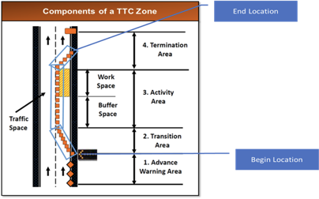
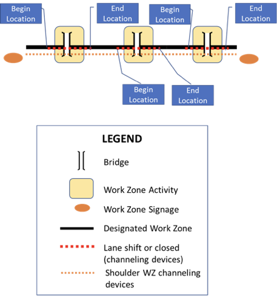
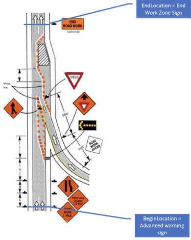
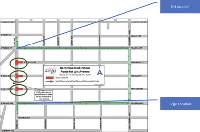
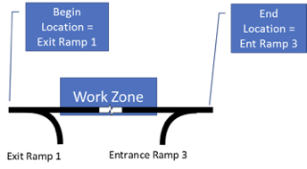

# 3 System Requirements \[Normative]

## 3.1 Introduction \[Informative]

The requirements for the CWZ Standard and Implementation Guide follow.

## 3.2 Architectural Requirements

The architectural requirements for the CWZ Standard and Implementation Guide follow.

### 3.2.1 Compatibility with the WZDx Specification

The CWZ WG believes that the approach described here supports the objective to preserve the investment of deployers in prior versions of WZDx, minimizing the burden of updating legacy deployments to this standard. The general approach below states that where applicable, a WZDx specification design element shall be reused, rather than developing new data requirements and design elements.

#### 3.2.1.1 Exceptions

During development of this standard, the CWZ WG asserted that full backward compatibility was not required, and that the following exceptions superseded the need for full backward compatibility with the WZDx v4.2 specification:

1. Elements described as DEPRECATED have been removed in this standard.
2. Some elements described as OPTIONAL have been made MANDATORY in this standard.
3. Some elements were renamed to generalize unit choices, for example the choice of miles or kilometers for reference post. Metric units were left as-is.
4. Certain enumerations elements were renamed for clarity in this standard.

#### 3.2.1.2 Requirement

Where applicable, data requirements described in this standard shall be reused, based on WZDx 4.2 specification to maintain compatibility with the WZDx specification and numerous current deployments, with exceptions as defined in Section 3.2.1.1.

### 3.2.2 GeoJSON Data Format

Work zone information shall be provided in the GeoJSON data format.

### 3.2.3 GeoJSON Data Validation

Work zone information in the GeoJSON data format shall be validated (verified) using the JSON Schema contained in this standard.

### 3.2.4 Business Rules

The following business rules help ensure standardized and interpretable use of the requirements in this standard. While this standard describes the required structure and data fields, business rules are additional requirements that promote consistent national level. Note that business rules are distinct from best practices in that the latter are suggestions and business rules are requirements that cannot be validated by the JSON schema.

#### 3.2.4.1 Event Segments Follow Attribute Changes

A work zone or detour must be segmented into separate WorkZoneRoadEvents or DetourRoadEvents if certain characteristics vary **within the overall location and/or time frame of the work zone or detour**. This rule exclusively applies to characteristics represented by the properties: road\_name, direction, start\_date, end\_date\*\*,\*\* vehicle\_impact, lanes, and worker\_presence\*\*.\*\*

The following guidelines are provided:

* A road event should identify any related WorkZoneRoadEvents and DetourRoadEvents using the related\_road\_events and project\_id properties on the RoadEventCoreDetails object.
* A series of sequential or recurring road events comprising a complex work zone or detour should use the first- and next-in-sequence or first- and next-occurrence enumerations of the RelatedRoadEventType. A work zone or detour represented by multiple road events should also use the project\_id property to identify the project that the events correspond to.
* A WorkZoneRoadEvent should identify any prescribed detour using the related-detour enumeration; a DetourRoadEvent should identify the work zone necessitating the detour using the related-work-zone enumeration; both may refer to the same project identifier as other work zones and detours in the project area.

#### 3.2.4.2 WorkZoneRoadEvent Lanes

If the lanes property on the WorkZoneRoadEvent is provided, it must include one entry for every lane in the road event. Providing lane information for only some of the lanes in a road event is not allowed.

#### 3.2.4.3 Lane Order

A Lane order or TrafficSensorLaneData lane\_order value of 1 must represent the left-most lane when facing downstream traffic and an increase in 1 must represent moving a single lane to the right.

#### 3.2.4.4 Data Source ID Referential Integrity

The data\_source\_id value must match to the data\_source\_id property of a FeedDataSource included within the same GeoJSON document on the WorkZoneRoadEvents and DetourRoadEvents.

#### 3.2.4.5 UTC Date-Time Format Specification

All dates and times must be expressed in UTC.

#### 3.2.4.6 UUID Format Specification

All universally unique identifiers (UUID) must comply with the UUID standard (RFC 4122) reference. There may be cases (e.g., cases of privacy) where the UUID may need to change over time.

## 3.3 Data Exchange Requirements

Requirements for data exchange follow.

### 3.3.1 Exchange WorkZoneFeed Information

Requirements for the exchange of WorkZoneFeed information follow.

#### 3.3.1.1 Send WorkZoneFeed Upon Request

A data provider shall send WorkZoneFeed information upon request from a data consumer.

### 3.3.2 Exchange DeviceFeed Information

Requirements for the exchange of DeviceFeed information follow.

#### 3.3.2.1 Send DeviceFeed Upon Request

A data provider shall send DeviceFeed information upon request from a data consumer.

## 3.4 WorkZoneFeed Requirements

The WorkZoneFeed includes the following data definitions, some of which are defined as optional.

### 3.4.1 Contents of WorkZoneFeed

The WorkZoneFeed shall consist of the following mandatory and optional requirements:

 a) **feed\_info.** Information about the Work Zone Feed. See [3.5 FeedInfo Requirements](#35-feedinfo-requirements). **Required**. 
 b) **type.** The GeoJSON object type. For a WorkZoneFeed, this must be the string 'FeatureCollection'. **Required.** 
 c) **features.** An array of GeoJSON Feature objects (RFC 7946 Section 3.2) representing a WorkZoneFeed's road events. The array consists of one or more instances of the RoadEventFeature. See [3.6 RoadEventFeature Requirements](#36-roadeventfeature-requirements). **Required.** 
 d) **bbox.** Information on the coordinate range for all RoadEventFeatures in the feed. Must be an array of length '2n' where 'n' is the number of dimensions represented in the contained geometries, with all axes of the most southwesterly point followed by all axes of the more northeasterly point. The axes order of a bbox follows the axes order of geometries. See [3.9 BoundingBox Requirements](#39-boundingbox-requirements). **Optional.** 

## 3.5 FeedInfo Requirements

The FeedInfo includes the following data definitions, some of which are defined as optional.

### 3.5.1 Contents of FeedInfo

The FeedInfo shall consist of the following mandatory and optional requirements:

 a) **publisher.** The organization responsible for publishing the feed. Example: 'State DOT'. **Required.** 
 b) **contact\_name.** The name of the individual or group responsible for the data feed. Example: 'Jo Help'. **Optional.** 
 c) **contact\_email.** The email address of the individual or group responsible for the data feed. Example: '[abc@testcity1.gov](mailto:abc@testcity1.gov)'. **Optional.** 
 d) **update\_frequency.** The frequency in seconds at which the data feed is updated. Example: '60'. A value of '-1' indicates that the data feed is not being updated. A value of '0' indicates update on change. **Required.** 
 e) **update\_date.** The UTC date and time when the GeoJSON file (representing the instance of the feed) was generated. The recency of the value of this property depends on if the feed producer is generating a new feed GeoJSON file for each request or generating the file in advance and making it available for download (this standard does not mandate a particular distribution method). Note all date-time formats shall follow RFC 3339 Section 5.6. Example: '2016-11-03T19:37:00Z'. Business Rule #5. **Required.** 
 f) **version.** The specification version used to create the data feed in 'major.minor' format. Note this mandates that all data in a feed complies to a single version of WorkZoneFeed. Examples: '1.1', '2.0'. **Required.** 
 g) **license.** The URL of the license that applies to the data in the feed. The recommended string is "[https://creativecommons.org/publicdomain/zero/1.0/](https://creativecommons.org/publicdomain/zero/1.0/)". **Required.** 
 h) **data\_sources.** A list of specific data sources for the road event data in the feed. Length of array must be at least one. See [3.5.2 FeedDataSource](#352-contents-of-feeddatasource). **Required.** 

### 3.5.2 Contents of FeedDataSource

The FeedDataSource shall consist of the following mandatory and optional requirements:

 a) **data\_source\_id.** A unique identifier for the data source organization providing work zone data. This identifier is a Universally Unique Identifier (UUID) as defined in RFC 4122 to guarantee uniqueness between feeds and over time. Linked to a road event by the 'data\_source\_id' property on the road event's core details or a field device by the 'data\_source\_id' property on the device's core details. See Business Rule #4. **Required.** 
 b) **organization\_name.** The name of the organization for the authoritative source of the work zone data. Example: County DOT. **Required.** 
 c) **contact\_name.** The name of the individual or group responsible for the data source. Example: 'Jo Help'. **Optional.** 
 d) **contact\_email.** The email address of the individual or group responsible for the data source. **Optional.** 
 e) **update\_frequency.** The frequency in seconds at which the data source is updated. A value of '-1' indicates that the data source is not being updated. A value of '0' indicates update on change. **Required.** 
 f) **update\_date.** The UTC date and time when the data source was last updated. All date-time formats shall follow RFC 3339 Section 5.6. Example: '2016-11-03T19:37:00Z'. See Business Rule #5. **Required.** 

## 3.6 RoadEventFeature Requirements

The RoadEventFeature includes the following data definitions, some of which are defined as optional.

### 3.6.1 Contents of RoadEventFeature

The RoadEventFeature shall consist of the following mandatory and optional requirements:

 a) **id**. A unique identifier issued by the data feed provider to identify the road event. This identifier is a Universally Unique Identifier (UUID) as defined in RFC 4122 to guarantee uniqueness between feeds and over time. This is a GeoJSON property. **Required.** 
 b) **type.** The GeoJSON object type. This MUST be the string 'Feature'. This is a GeoJSON property. **Required.** 
 c) **properties.** The specific details of the road event. This is a GeoJSON property. The road event consists of either a WorkZoneRoadEvent or a DetourRoadEvent. See [3.6.2 Contents of WorkZoneRoadEvent](#362-contents-of-workzoneroadevent) or [3.6.3 Contents of DetourRoadEvent](#363-contents-of-detourroadevent). **Required.** 
 d) **geometry.** The geometry of the road event. The Geometry object's 'type' property MUST be LineString (RFC 7946 Section 3.1.4) or Point (RFC 7946 Section 3.1.2). 'LineString' allows specifying the entire road event path and should be preferred. 'LineString' should be used when at least the start and end coordinates are known. The order of coordinates is meaningful: the first coordinate is the first (furthest upstream) point a road user encounters when traveling through the road event. 'Point' should be used when only one coordinate is known. Where both start and end data are required (e.g., is\_start\_position\_verified and is\_end\_position\_verified), the 'Point' type is allowed. **Required.** 
 e) **bbox.** Information on the coordinate range for this RoadEventFeature. Must be an array of length '2n' where 'n' is the number of dimensions represented in the 'geometry' property, with all axes of the most southwesterly point followed by all axes of the more northeasterly point. The axes order of a bbox follows the axes order of the 'geometry'. This is a GeoJSON property. See [3.9 BoundingBox Requirements](#39-boundingbox-requirements). **Optional.** 

### 3.6.2 Contents of WorkZoneRoadEvent

The WorkZoneRoadEvent shall consist of the following mandatory and optional requirements:

 a) **core\_details.** The core details shared by all types of road events, not specific to work zones. See Business Rule #1. See [3.6.4 Contents of RoadEventCoreDetails](#364-contents-of-roadeventcoredetails). **Required.** 
 b) **beginning\_cross\_street.** Name or number of the nearest cross street along the roadway where the event begins. **Optional.** 
 c) **ending\_cross\_street.** Name or number of the nearest cross street along the roadway where the event ends. **Optional.** 
 d) **beginning\_reference\_post.** The linear distance measured against a reference post marker along a roadway where the event begins. A reference post may be a milepost or mile marker, a surveyed distance posted along a roadway measuring the length (in miles or tenth of a mile) from the south west to the north east. These markers are typically notated on State and local government digital road networks. **Optional.** 
 e) **ending\_reference\_post.** The linear distance measured against a reference post marker along a roadway where the event ends. A reference post may be a milepost or mile marker, a surveyed distance posted along a roadway measuring the length (in miles or tenth of a mile) from the south west to the north east. These markers are typically notated on State and local government digital road networks. **Optional.** 
 f) **reference\_post\_unit.** Unit of measurement for the WorkZoneRoadEvent 'beginning\_reference\_post' and 'ending\_reference\_post', if applicable. See [3.6.19 Enumeration of UnitOfMeasurement](#3619-enumeration-of-unitofmeasurement). **Conditional;** required if either 'beginning\_reference\_post' or ending\_reference\_post' is not null. 
 g) **is\_start\_position\_verified.** Indicates if the start position (first geometric coordinate pair) is based on actual reported data from a GPS-equipped device that measured the location of the start of the work zone. **Required.** 
 h) **is\_end\_position\_verified.** Indicates if the end position (last geometric coordinate pair) is based on actual reported data from a GPS-equipped device that measured the location of the end of the work zone. **Required.** 
 i) **start\_date.** The UTC time and date when the event begins. All date-time formats shall follow RFC 3339 Section 5.6. Example: '2016-11-03T19:37:00Z'. See Business Rule #5. **Required.** 
 j) **end\_date.** The UTC time and date when the event ends. All date-time formats shall follow RFC 3339 Section 5.6. Example: '2016-11-03T19:37:00Z'. See Business Rule #5. **Required.** 
 k) **is\_start\_date\_verified.** Indicates if work has been confirmed to have started, such as from a person or field device. **Required.** 
 l) **is\_end\_date\_verified.** Indicates if work has been confirmed to have ended, such as from a person or field device. **Required.** 
 m) **work\_zone\_type.** The type of work zone road event, such as if the road event is static or actively moving as part of a moving operation. See [3.6.13 Enumeration of WorkZoneType](#3613-enumeration-of-workzonetype). **Optional.** 
 n) **vehicle\_impact.** The impact to vehicular lanes along a single road in a single direction. See [3.6.14 Enumeration of VehicleImpact](#3614-enumeration-of-vehicleimpact). **Required.** 
 o) **location\_method.** The typical method used to locate the beginning and end of a work zone impact area. See [3.6.5 Enumeration of LocationMethod](#365-enumeration-of-locationmethod). **Required.** 
 p) **worker\_presence.** Indicates whether workers are present in the road event area. See [3.6.11 Contents of WorkerPresence](#3611-contents-of-workerpresence). **Optional.** 
 q) **reduced\_speed\_limit\_kph.** The reduced speed limit posted within the road event, in kilometers per hour. This property only needs to be supplied if the speed limit within the road event is lower than the posted speed limit of the roadway. **Optional.** 
 r) **restrictions.** A list of zero or more road restrictions that apply to the roadway segment described by this road event. Restrictions can also be provided on an individual lane. See [3.6.9 Contents of Restriction.](#369-contents-of-restriction) **Optional.** 
 s) **types\_of\_work.** A list of the types of work being performed in a road event and whether each type results in an architectural change to the roadway. See [3.6.7 Contents of TypeOfWork](#367-contents-of-typeofwork). **Optional.** 
 t) **lanes.** A list of individual lanes within a road event (roadway segment). See Business Rules #1 and #2. See [3.6.8 Contents of Lane](#368-contents-of-lane). **Optional.** 
 u) **impacted\_cds\_curb\_zones.** A list of references to external CDS Curb Zones impacted by the work zone. See [3.6.10 Contents of CdsCurbZonesReference](#3610-contents-of-cdscurbzonesreference). **Optional.** 

### 3.6.3 Contents of DetourRoadEvent

The DetourRoadEvent shall consist of the following mandatory and optional requirements:

 a) **core\_details.** The core details of the road event that are shared by all types of road events, not specific to detours. See Business Rule #1. See [3.6.4 Contents of RoadEventCoreDetails](#364-contents-of-roadeventcoredetails). **Required.** 
 b) **beginning\_cross\_street.** Name or number of the nearest cross street where the event begins. **Optional.** 
 c) **ending\_cross\_street.** Name or number of the nearest cross street where the event ends. **Optional.** 
 d) **beginning\_reference\_post.** The linear distance measured against a reference post marker along a roadway where the event begins. A reference post may be a milepost or mile marker, a surveyed distance posted along a roadway measuring the length (in miles or tenth of a mile) from the southwest to the northeast. These markers are typically notated on state and local government digital road networks. **Optional.** 
 e) **ending\_reference\_post.** The linear distance measured against a reference post marker along a roadway where the event ends. A reference post may be a milepost or mile marker, a surveyed distance posted along a roadway measuring the length (in miles or tenth of a mile) from the south west to the north east. These markers are typically notated on State and local government digital road networks. **Optional**. 
 f) **reference\_post\_unit.** Unit of measurement for the DetourRoadEvent 'beginning\_reference\_post' and 'ending\_reference\_post', if applicable. See [3.6.19 Enumeration of UnitOfMeasurement](#3619-enumeration-of-unitofmeasurement). **Conditional;** required if either 'beginning\_reference\_post' or ending\_reference\_post' is not null. 
 g) **start\_date.** The UTC time and date when the event begins. All date-time formats shall follow RFC 3339 Section 5.6. Example: '2016-11-03T19:37:00Z'. See Business Rule #5. **Required.** 
 h) **end\_date.** The UTC time and date when the event ends. All date-time formats shall follow RFC 3339 Section 5.6 Example: '2016-11-03T19:37:00Z'. See Business Rule #5. **Required.** 
 i) **is\_start\_date\_verified.** Indicates whether the detour start has been confirmed by a person, field device, or traffic management center. **Required.** 
 j) **is\_end\_date\_verified.** Indicates whether the detour end has been confirmed by a person, field device, or traffic management center. **Required.** 

### 3.6.4 Contents of RoadEventCoreDetails

The RoadEventCoreDetails shall consist of the following mandatory and optional requirements:

 a) **data\_source\_id.** Identifies the data source from which the road event originates. See Business Rule #4. **Required.** 
 b) **event\_type.** The type/classification of road event. See [3.6.12 Enumeration of EventType](#3612-enumeration-of-eventtype). **Required.** 
 c) **related\_road\_events.** A list of related road events. Examples include but are not limited to the sequence along the roadway, recurring work zones, related detours, or other associated road events in a similar work area. See [3.6.6 Contents of RelatedRoadEvent](#366-contents-of-relatedroadevent). **Optional.** 
 d) **project\_id.** An identifier for the project that the event is part of. A project is the highest-level representation of an area where road work takes place and may span multiple adjacent or intersecting roadways. A project will contain one or more RoadEventFeatures. This project ID does not correspond to an object in a WorkZoneFeed. It is used to group events (and devices, see FieldDeviceCoreDetails) and is a Universally Unique Identifier (UUID) as defined in RFC 4122 to guarantee uniqueness between feeds and over time. **Optional.** 
 e) **road\_names.** A list of publicly known names of the road on which the event occurs. This may include the road number designated by a jurisdiction such as a county, state, or interstate (e.g., I-5, VT 133). **Required.** 
 f) **direction.** The digitization direction of the road that is impacted by the event. This value is based on the standard naming for U.S. roadways and indicates the direction of the traffic flow regardless of the real heading angle. Example 'northbound' (for I-5 North). See [3.8 Direction Requirements](#38-direction-requirements). **Required.** 
 g) **name.** A human-readable name for the road event. **Optional.** 
 h) **description.** Short free text description of road event. **Optional.** 
 i) **creation\_date.** The UTC time and date when the activity or event was created. All date-time formats shall follow RFC 3339 Section 5.6. Example: '2016-11-03T19:37:00Z'. See Business Rule #5. **Optional.** 
 j) **update\_date.** The UTC date and time when the RoadEventFeature (including child objects) that the RoadEventCoreDetails applies to was most recently updated or confirmed as up to date. All date-time formats shall follow RFC 3339 Section 5.6. Example: '2016-11-03T19:37:00Z'. See Business Rule #5. **Optional.** 

### 3.6.5 Enumeration of LocationMethod

The LocationMethod Enumerated Type describes the typical method used to locate the beginning and end of a work zone impact area.

The following identifies the enumerations for LocationMethod:

* **channel-device-method.** Location of first and last channeling device (e.g., cone or barrier) that is part of a "travel impact effect" (taper) or designates a work zone transition area. *This is the preferred location method.*
* **sign-method.** Location of first and last work zone-related signs.
* **junction-method.** Location of a junction (e.g., a cross street or exit/entrance ramp) before and after a work zone.
* **other.** Location method does not match any of the other options.
* **unknown.** Location method is not known.

**Additional Information**

The following sections detail the usage of each location method.

* **channel-device-method** (Preferred Method)

Location of first and last channeling device (e.g., cone or barrier) that is part of a "travel impact effect" (taper) or designates a work zone transition area. For complex work zones with multiple activities, beginning and end locations are the first channeling device for first activity up to the last channeling device of the last activity.

* **Simple Scenario**

This example shows one work zone area within a single work zone project. See Figure 5.

Figure 5. Simple Scenario

* **Complex Scenario**

This example shows three work zone activity areas within a single work zone project. Each activity area is treated as an independent work zone activity record, with its own beginning and end locations corresponding to where each lane taper begins and ends. See Figure 6.

Figure 6. Complex Scenario

* **sign-method**

Location of first and last work zone-related signs, which may differ from the channelization location. For complex work zones, the beginning location would be the first sign before the first activity, and the end would be the last sign following the last activity. See Figure 7.

Figure 7. Sign Method

* **junction-method**

Location of a Junction (e.g., a cross street or exit/entrance ramp) before and after a work zone. Note that this is similar to the approach used by Waze to designate a road closure event.
 
* **Arterial Scenario**

See Figure 8.

Figure 8. Arterial Scenario

* **Highway Scenario**

See Figure 9.

Figure 9. Highway Scenario

### 3.6.6 Contents of RelatedRoadEvent

The RelatedRoadEvent shall consist of the following requirements:

 a) **type.** The type of relationship with the road event being identified, such as another sequence of related work zones, a detour, or the next road event in sequence. See [3.6.23 Enumeration of RelatedRoadEventType](#3623-enumeration-of-relatedroadeventtype). **Required.** 
 b) **id.** An identifier for the related road event. The value must correspond to the 'id' of a RoadEventFeature within the same feed. **Required.** 

### 3.6.7 Contents of TypeOfWork

The TypeOfWork shall consist of the following mandatory and optional requirements:

 a) **type\_name.** A high-level text description of the type of work being done. See [3.6.16 Enumeration of WorkTypeName](#3616-enumeration-of-worktypename). **Required.** 
 b) **is\_architectural\_change.** A flag indicating whether the type of work will result in an architectural change to the roadway. **Optional.** 

### 3.6.8 Contents of Lane

The Lane shall consist of the following mandatory and optional requirements:

 a) **order.** The position of a lane in sequence on the roadway. This value is an index indicating the order of all the lanes for a road event, starting with 1 for the left-most lane. See Business Rule #3. **Required.** 
 b) **status.** Status of the lane for the traveling public. See [3.6.17 Enumeration of LaneStatus](#3617-enumeration-of-lanestatus). **Required.** 
 c) **type.** An indication of the type of lane or shoulder. See [3.6.18 Enumeration of LaneType](#3618-enumeration-of-lanetype). **Required.** 
 d) **restrictions.** A list of zero or more restrictions specific to the lane. See [3.6.9 Contents of Restriction](#369-contents-of-restriction). **Optional.** 

### 3.6.9 Contents of Restriction

The Restriction shall consist of the following mandatory and optional requirements:

 a) **type.** The type of restriction being enforced. See [3.6.15 Enumeration of RestrictionType](#3615-enumeration-of-restrictiontype). **Required.** 
 b) **value.** A value associated with the restriction, if applicable. For example, if 'type' is 'reduced-height', 'value' and 'unit' together would allow indicating what value the height was reduced to. **Optional.** 
 c) **unit.** Unit of measurement for the restriction 'value', if applicable. See [3.6.19 Enumeration of UnitOfMeasurement](#3619-enumeration-of-unitofmeasurement). **Conditional:** required if 'value' is not null. 

### 3.6.10 Contents of CdsCurbZonesReference

The CdsCurbZonesReference shall consist of the following requirements. See OpenMobilityFoundation's Curb Data Specification at [https://github.com/openmobilityfoundation/curb-data-specification](https://github.com/openmobilityfoundation/curb-data-specification).

 a) **cds\_curb\_zone\_ids.** A list of CDS Curb Zone 'ids'. **Required.** 
 b) **cds\_curbs\_api\_url.** An identifier for the source of the requested CDS Curbs API. This MUST be a full HTTPS URL pointing to the main Curbs API that contains detailed information about each curb zone identified in 'cds\_curb\_zone\_ids'. **Required.** 

### 3.6.11 Contents of WorkerPresence

The WorkerPresence shall consist of the following mandatory and optional requirements:

 a) **are\_workers\_present.** Indicates whether workers are present in the work zone event area. This value align with the definition provided in the 'definition' property if it is provided. **Required.** 
 b) **method.** how worker presence in a work zone event area is determined. See [3.6.20 Enumeration of WorkerPresenceMethod](#3620-enumeration-of-workerpresencemethod). **Optional.** 
 c) **worker\_presence\_last\_confirmed\_date.** The UTC date and time at which the presence of workers was last confirmed. All date-time formats shall follow RFC 3339 Section 5.6. See Business Rule #5. **Optional.** 
 d) **confidence.** The data producer's confidence in the value of 'are\_workers\_present'. See [3.6.22 Enumeration of WorkerPresenceConfidence](#3622-enumeration-of-workerpresenceconfidence). **Optional.** 
 e) **definition.** A list of situations in which workers are considered to be present in the jurisdiction of the data provider. See [3.6.21 Enumeration of WorkerPresenceDefinition](#3621-enumeration-of-workerpresencedefinition). **Optional.** 
 f) **other\_method.** Details the method used to determine worker presence in a work zone event area if the enumeration method is 'other'.. **Conditional;** required if 'method' enumeration is 'other'. 

### 3.6.12 Enumeration of EventType

The EventType Enumerated Type describes the type of a WorkZoneFeed road event.

The following identifies the enumerations for EventType:

* **work-zone.** An area of a trafficway with highway construction, maintenance, or utility-work activities. A work zone is typically marked by signs, channeling devices, barriers, pavement markings, and/or work vehicles. It extends from the first warning sign or flashing lights on a vehicle to the "End of Road Work" sign or the last traffic control device. A work zone may vary in durations and may include stationary or moving activities.

Inclusions:

* 
1. Long-term stationary highway construction such as building a new bridge, adding travel lanes to the roadway, and extending an existing trafficway.
2. Mobile highway maintenance, such as striping the roadway median, roadside grass mowing/landscaping, and pothole repair.
3. Short-term stationary utility work such as repairing electric, gas, or water lines within the trafficway.

Exclusions:

1. Private construction, maintenance, or utility work outside the trafficway.

\*The AASHTO term equivalent to "roadway" is "traveled way."

\*The AASHTO term equivalent to "trafficway" is "highway, street, or road."

Source: [https://www.fhwa.dot.gov/publications/publicroads/99mayjun/workzone.cfm](https://www.fhwa.dot.gov/publications/publicroads/99mayjun/workzone.cfm)

* **detour.** A temporary rerouting of road users onto an existing trafficway to avoid a work zone or other impedance

Source: [https://mutcd.fhwa.dot.gov/htm/2009/part6/part6c.htm](https://mutcd.fhwa.dot.gov/htm/2009/part6/part6c.htm)

### 3.6.13 Enumeration of WorkZoneType

The WorkZoneType Enumerated Type describes the type of work zone road event.

The following identifies the enumerations for WorkZoneType:

* **static.** The road event statically placed - not moving.
* **moving.** The road event is actively moving on the roadway. As opposed to 'planned-moving-area', the road event geometry changes as the operation moves.
* **planned-moving-area.** The planned extent of a moving operation. The active work area will be somewhere within this road event. As opposed to 'moving', the road event geometry typically does not actively change.

### 3.6.14 Enumeration of VehicleImpact

The VehicleImpact Enumerated Type describes the impact to vehicular lanes along a single road in a single direction.

The following identifies the enumerations for VehicleImpact:

* **all-lanes-closed.** All lanes are closed
* **some-lanes-closed.** Some lanes are closed
* **all-lanes-open.** All lanes are open
* **alternating-one-way.** The roadway is alternating one way
* **some-lanes-closed-merge-left.** Some lanes merge to the left
* **some-lanes-closed-merge-right.** Some lanes merge to the right
* **all-lanes-open-shift-left.** All lanes are open, shift to the left
* **all-lanes-open-shift-right.** All lanes are open, shift to the right
* **some-lanes-closed-split.** Some lanes end and split and merge to the right and left
* **flagging.** A flagging operation is in effect
* **temporary-traffic-signal.** A temporary traffic signal is in operation
* **unknown.** The vehicle impact is unknown

### 3.6.15 Enumeration of RestrictionType

The RestrictionType Enumerated Type describes the type of vehicle restriction on a roadway.

The following identifies the enumerations for RestrictionType:

* **local-access-only.** Access is restricted to local addresses, emergency services, deliveries, and direct property access.
* **no-trucks.** Trucks are prohibited from traveling this part of the network.
* **travel-peak-hours-only.** Travel restricted to travel peak hours only.
* **hov-3.** Travel restricted to high occupancy vehicles of three or more.
* **hov-2.** Travel restricted to high occupancy vehicles of two or more.
* **no-parking.** No parking along the segment being described.
* **reduced-width.** Lane width is reduced along the segment being described.
* **reduced-height.** Height restrictions are reduced along the segment being described.
* **reduced-length.** Vehicle length restrictions are reduced along the segment being described.
* **reduced-weight.** Vehicle weight restrictions are reduced along the segment being described.
* **axle-load-limit.** Vehicle axle-load-limit restrictions are reduced along the segment being described.
* **gross-weight-limit.** Vehicle gross-weight-limit restrictions are reduced along the segment being described.
* **towing-prohibited.** Towing is prohibited along the segment being described.
* **permitted-oversize-loads-prohibited.** "Permitted oversize loads" prohibited along the segment being described; this applies to annual oversize load permits.
* **no-passing.** Crossing the center line markings for passing is prohibited.

### 3.6.16 Enumeration of WorkTypeName

The WorkTypeName Enumerated Type is a high-level text description of the type of work being done in a road event.

The following identifies the enumerations for WorkTypeName:

* **non-encroachment.** Work with no impact on the roadway, such as trash pickup, mowing, or landscaping.
* **minor-road-defect-repair.** Pothole repair, road crack repair and sealing, and other small road defect repairs.
* **roadside-work.** Work that is isolated to the side of the road and not in the main travel way, such as repair, replacement, or addition of streetlights, VMS, signs (guide, warning, regulatory, and information signs) in the ground.
* **overhead-work.** Work that occurs above the road, such as repair/replacement of overpasses, overhead VMS, wires, overhead signs, signals, etc. This type of work requires a bucket truck or similar setup rather than being isolated to the side of the road.
* **below-road-work.** Work occurring below the road such as boring or bridge repair.
* **barrier-work.** Repair, replacement, addition, or change of barriers, guardrails, retaining walls, K-barriers, or similar.
* **surface-work.** New resurfacing, such as adding new lanes, moving lanes, or adding or changing connectivity (turn lanes), as well as creation or repair of non-drivable surfaces such as the shoulder or median.
* **painting.** Repainting, re-striping, adding new lanes, moving lanes, adding stop bars/lines, etc. *Note: 'is\_architectural\_change' (See 3.6.7 b)) field should be false when new paint is expected to be within 1 meter of the old paint.*
* **roadway-relocation.** Physically relocating the road, such as adding a bridge or removing a sharp curve.
* **roadway-creation.** Adding a new road.

### 3.6.17 Enumeration of LaneStatus

The LaneStatus Enumerated Type describes the status of a lane for the traveling public.

The following identifies the enumerations for LaneStatus:

* **open.** The lane is open for normal usage
* **closed.** The lane is closed to normal usage
* **shift-left.** The lane shifts left from its current bearing and continues
* **shift-right.** The lane shifts right from its current bearing and continues
* **merge-left.** The lane gradually tapers while merging into the lane directly to the left
* **merge-right.** The lane gradually tapers while merging into the lane directly to the right
* **alternating-flow.** Traffic may travel in either direction, depending on certain conditions. Example conditions include time of day (e.g., reversible lanes), automated controls, or on-site personnel

### 3.6.18 Enumeration of LaneType

The LaneType Enumerated Type provides a description of the static properties of a section of the roadway, intended to reflect information about its function that is not covered by its status (see LaneStatus).

The following identifies the enumerations for LaneType:

* **general.** A generic lane type, intended to be used for general purpose travel lanes.
* **exit-lane.** A lane leading towards an egress from the current roadway. An 'exit-lane' usually becomes an 'exit-ramp' after a gore point.
* **exit-ramp.** A lane at an interchange leading away from the current roadway to another roadway.
* **entrance-lane.** A lane leading away from an ingress to the current roadway. An 'entrance-ramp' usually becomes an 'entrance-lane' after a gore point.
* **entrance-ramp.** A lane at an interchange for traffic to ingress from another roadway to the mainline.
* **sidewalk.** A path for pedestrians, usually on the side of the roadway.
* **bike-lane.** A lane on the roadway for use by cyclists only.
* **shoulder.** A portion of the roadway that is outside (either right or left) of the main travel lanes. A shoulder can have many uses but is not intended for general traffic.
* **parking.** A lane designated for parking that prohibits travel.
* **median.** An often unpaved, non-drivable area that separates sections of the roadway. In most cases a median should only be described if it separates lanes in a single direction of travel. As per Business Rule #1 each direction of travel must be represented by a separate road event.
* **two-way-center-turn-lane.** A lane in the center of a bidirectional roadway that traffic from both directions uses to make a turn that crosses the opposite direction of traffic (i.e., left in right-side driving countries, and right in left-side driving countries).

**Additional Information**

The LaneType enumerated type was originally based on the TMDD LaneRoadway Enumeration, which was imported into TMDD from SAE 2540 (ITIS Standard). In later release, other standards were examined for inspiration. These include SAE J2735 and the ISO 20524-1 Geographic Data Files (GDF) standard.

### 3.6.19 Enumeration of UnitOfMeasurement

The UnitOfMeasurement Enumerated Type indicates the unit of measurement. This enumerated type is intended for use across the specification and more values can be added in the future if needed.

The following identifies the enumerations for UnitOfMeasurement:

* **feet.** Imperial system 'feet'
* **inches.** Imperial system 'inches'
* **centimeters.** Metric system 'centimeters'
* **pounds.** Imperial system 'pounds'
* **tons.** Imperial system 'tons'
* **kilograms.** Metric system 'kilograms'
* **miles.** Imperial system 'miles'
* **kilometers.** Metric system 'kilometers'

### 3.6.20 Enumeration of WorkerPresenceMethod

The WorkerPresenceMethod Enumerated Type describes methods for determining worker presence in a work zone event area.

The following identifies the enumerations for WorkerPresenceMethod:

* **camera-monitoring.** Presence of workers is confirmed through cameras in the work zone event area.
* **maintenance-vehicle-present.** A GPS-enabled maintenance vehicle is located in the road event area.
* **wearables-present.** Workers wearing wearable detection equipment are present in the work zone.
* **mobile-device-present.** Workers with a GPS-enabled mobile device on their person are present in the work zone.
* **check-in-app.** Workers have checked into the work zone via a mobile app.
* **check-in-verbal.** Workers have checked into the work zone via phone or radio to a remote operations center.
* **other.** Worker presence determined through another method. Details in text field for WorkerPresence other\_method.

### 3.6.21 Enumeration of WorkerPresenceDefinition

The WorkerPresenceDefinition Enumerated Type describes situations in which workers may be considered present in a work zone.

The following identifies the enumerations for WorkerPresenceDefinition:

* **workers-in-work-zone-working.** Humans are physically in the work zone event area, doing road work.
* **workers-in-work-zone-not-working.** Humans are physically in the work zone event area but not performing work.
* **mobile-equipment-in-work-zone-moving.** Mobile equipment is moving within the work zone event area, implying the presence of a worker.
* **mobile-equipment-in-work-zone-not-moving.** Mobile equipment is in the work zone event area but is not moving.
* **fixed-equipment-in-work-zone.** Fixed equipment is in the work zone event area.
* **humans-behind-barrier.** Humans are present in the work zone event area but separated from traffic by a barrier.
* **humans-in-right-of-way.** Humans are present on the drivable surface.

### 3.6.22 Enumeration of WorkerPresenceConfidence

The WorkerPresenceConfidence Enumerated Type is a high-level description of a feed publisher's confidence in the reported value of 'are\_workers\_present' on the WorkerPresence object.

The following identifies the enumerations for WorkerPresenceConfidence:

* **low.** Feed publisher is not confident in the reported value, such as when data is manually reported or not updated frequently.
* **medium.** Feed publisher is somewhat confident in the reported value, such as when the value is manually reported but is being updated in a timely manner, or when worker presence is indirectly inferred from other equipment like a smart arrow board.
* **high.** Feed publisher is very confident in the reported value, such as when automated systems with GPS locations are used to generate the value.

### 3.6.23 Enumeration of RelatedRoadEventType

The RelatedRoadEventType Enumerated Type describes the relationship between road events, and the road event that the RelatedRoadEvent object references. For example, it may indicate the first road event in a sequence of events along the roadway, an instance of a recurrent work zone, a nearby work zone-type road event, or a nearby detour-type road event.

In many cases, the related road event type only refers to the first road event, as the corresponding "work zone" may encompass multiple road events. In these situations, end users must identify the "first" road event and iterate through all linked road events to find all related road events.

The following identifies the enumerations for RelatedRoadEventType:

* **first-in-sequence.** The first road event in a sequence of road events that together describe a full work zone or detour
* **next-in-sequence.** The next (subsequent) road event in a sequence of road events that together describe a full work zone or detour
* **first-occurrence.** The first road event in the first occurrence in time of a recurrent work zone
* **next-occurrence.** The first road event in the next occurrence in time of a recurrent work zone
* **related-work-zone.** The first road event of related work zones (i.e., not part of a sequence of road events or recurrent work zone)
* **related-detour.** The first road event of related detours (i.e., not part of a sequence of road events)
* **planned-moving-operation.** The first road event of a related planned moving operation work zones (i.e., not part of a sequence of road events)
* **active-moving-operation.** The first road event of a related active moving operation work zones (i.e., not part of a sequence of road events)

## 3.7 DeviceFeed Requirements

The DeviceFeed includes the following data definitions, some of which are defined as optional.

### 3.7.1 Contents of DeviceFeed

The DeviceFeed shall consist of the following mandatory and optional requirements:

 a) **feed\_info.** Information about the data feed. This is a standard-specific foreign member and is not part of the GeoJSON specification. See [3.5 FeedInfo Requirements](#35-feedinfo-requirements). **Required.** 
 b) **type.** The GeoJSON object type. For this standard, this must be the string 'FeatureCollection'. This is a GeoJSON property. **Required.** 
 c) **features.** An array of GeoJSON Feature objects which each represent a field device deployed in a work zone. This is a GeoJSON property. See [3.7.2 Contents of FieldDeviceFeature](#372-contents-of-fielddevicefeature). **Required.** 
 d) **bbox.** Coordinate range for all 'FieldDeviceFeature's in the feed. The value must be an array of length '2n', where 'n' is the number of dimensions represented in the contained geometries, with all axes of the most southwesterly point followed by all axes of the more northeasterly point. The axes order of a 'bbox' follows the axes order of geometries. This is a GeoJSON property. See [3.9 BoundingBox Requirements](#39-boundingbox-requirements). **Optional.** 

### 3.7.2 Contents of FieldDeviceFeature

The FieldDeviceFeature shall consist of the following mandatory and optional requirements:

 a) **id.** A unique identifier issued by the data feed provider to identify the field device. This identifier is a Universally Unique Identifier (UUID) as defined in RFC 4122 to guarantee uniqueness between feeds and over time. This is a GeoJSON property. **Required.** 
 b) **type.** The GeoJSON object type. This MUST be the string 'Feature'. This is a GeoJSON property. **Required.** 
 c) **properties.** The specific details of the field device. This is a GeoJSON property. See [3.7.3 FieldDeviceCoreDetails](#373-contents-of-fielddevicecoredetails). **Required.** 
 d) **geometry.** The geometry of the field device, indicating its location. The Geometry object's 'type' property MUST be Point (RFC 7946 Section 3.1.2). This is a GeoJSON property. **Required.** 
 e) **bbox.** The coordinate range for this field device. Must be an array of length '2n', where 'n' is the number of dimensions represented in the 'geometry' property, with all axes of the most southwesterly point followed by all axes of the more northeasterly point. The axes order of a bbox follows the axes order of the 'geometry'. This is a GeoJSON property. See [3.9 BoundingBox Requirements](#39-boundingbox-requirements). **Optional.** 

### 3.7.3 Contents of FieldDeviceCoreDetails

The FieldDeviceCoreDetails shall consist of the following mandatory and optional requirements:

 a) **device\_type**. The type of field device. See [3.7.17 Enumeration of FieldDeviceType](#3717-enumeration-of-fielddevicetype). **Required**. 
 b) **data\_source\_id**. Identifies the data source from which the field device data originates. **Required**. 
 c) **device\_status**. The operational status of the field device, indicating whether the device is functioning properly or is in an error or warning state. See [3.7.18 Enumeration of FieldDeviceStatus](#3718-enumeration-of-fielddevicestatus). **Required**. 
 d) **update\_date**. The UTC time and date when the field device information was last updated. **Required**. 
 e) **has\_automatic\_location**. A yes/no value indicating if the field device location (parent FieldDeviceFeature's 'geometry') is determined automatically by an onboard GPS ('true') or manually set/overridden ('false'). **Required**. 
 f) **road\_direction**. The direction of the road that the field device is on. This value indicates the direction of the traffic flow of the road, not a real heading angle. See [3.8 Direction Requirements](#38-direction-requirements). **Optional**. 
 g) **road\_names**. A list of publicly known names of the road on which the device is located. This may include the road number designated by a jurisdiction such as a county, state, or interstate (e.g., I-5, VT 133). **Optional.** 
 h) **name**. A human-readable name for the field device. **Optional.** 
 i) **description**. A description of the field device. **Optional.** 
 j) **status\_messages**. A list of messages associated with the device's status, if applicable, providing additional information about the status such as specific warning or error messages. **Optional**. Note: The content of this property is determined by the producer. 
 k) **is\_moving**. A yes/no value indicating if the device is actively moving (not statically placed) as part of a mobile work zone operation. **Optional**. Note: The 'is\_moving' property is optional and should not be provided if it is not known whether the device is moving. 
 l) **road\_event\_ids**. A list of one or more IDs of a road event feature. See RoadEventFeature that the device is associated with. **Optional.** 
 m) **project\_id.** An identifier for the project associated with the device.. A project is the highest-level representation of an area where road work takes place and may include multiple roadways if they are adjacent or intersecting. This project ID does not correspond to an object in a WorkZoneFeed. It is used to group devices (and events, see RoadEventCoreDetails). This identifier is a Universally Unique Identifier (UUID) as defined in RFC 4122 to guarantee uniqueness between feeds and over time. **Optional.** 
 n) **reference\_post**. The linear distance measured against a reference post (such as a milepost marker) along the roadway where the device is located. **Optional.** 
 o) **reference\_post\_unit.** Unit of measurement for the FieldDeviceCoreDetails 'reference\_post', if applicable. See [3.7.15 Enumeration of UnitOfMeasurement.](#3715-enumeration-of-unitofmeasurement) **Conditional:** Required if 'reference\_post' is not null. 
 p) **make**. The make or manufacturer of the device. **Optional.** 
 q) **model**. The model of the device. **Optional.** 
 r) **serial\_number**. The serial number of the device. **Optional.** 
 s) **firmware\_version**. The version of firmware the device is using to operate. **Optional.** 
 t) **velocity\_kph**. The velocity of the device in kilometers per hour. **Optional.** 
 u) **is\_in\_transport\_position.** A yes/no value indicating if the device is in the stowed/transport position ('true') or deployed/upright position ('false'). **Optional.** 

### 3.7.4 Contents of ArrowBoard

The ArrowBoard shall consist of the following mandatory and optional requirements:

 a) **core\_details.** The core details shared by all types of field devices, not specific to arrow boards. This property appears on all field devices. See [3.7.3 Contents of FieldDeviceCoreDetails](#373-contents-of-fielddevicecoredetails). **Required.** 
 b) **pattern.** The current pattern displayed on the arrow board. Note this includes 'blank', which indicates that no pattern is shown on the arrow board. See [3.7.16 Enumeration of ArrowBoardPattern](#3716-enumeration-of-arrowboardpattern). **Required.** 

### 3.7.5 Contents of Camera

The Camera shall consist of the following mandatory and optional requirements:

 a) **core\_details.** The core details shared by all types of field devices, not specific to cameras. This property appears on all field devices. See [3.7.3 Contents of FieldDeviceCoreDetails](#373-contents-of-fielddevicecoredetails). **Required.** 
 b) **image\_url.** A URL pointing to an image file of the camera's current still image. **Optional.** 
 c) **is\_image\_url\_public.** Identifies whether the image\_url is publicly accessible. **Optional.** 
 d) **image\_timestamp.** The UTC date and time when the image was captured. See Business Rule #5. **Conditional;** required if 'image\_url' is provided. 
 e) **video\_url.** A URL pointing to a video file for the camera video. **Optional.** 
 f) **is\_video\_url\_public.** Identifies whether the video\_url is publicly accessible. **Optional.** 
 g) **video\_update\_frequency.** The frequency at which the video feed is updated. A value of '-1' indicates that the video feed is not being updated (i.e., a video clip). A value of '0' indicates that the video feed is live. A positive integer value indicates that the video feed is being recorded on a loop where the value is the length of one loop in minutes. **Conditional:** Required if 'video\_url' is not null. 

### 3.7.6 Contents of DynamicMessageSign

The DynamicMessageSign shall consist of the following requirements:

 a) **core\_details.** The core details shared by all types of field devices, not specific to dynamic message signs. This property appears on all field devices. See [3.7.3 Contents of FieldDeviceCoreDetails](#373-contents-of-fielddevicecoredetails). **Required.** 
 b) **message\_multi\_string.** The MULTI-formatted string (Mark-Up Language for Transportation Information, see NTCIP 1203 v03) describing the message currently posted to the sign. If the message is unknown due to an error, the empty string ('') can be used. **Required.** 

### 3.7.7 Contents of FlashingBeacon

The FlashingBeacon shall consist of the following mandatory and optional requirements:

 a) **core\_details.** The core details shared by all types of field devices, not specific to flashing beacons. This property appears on all field devices. See [3.7.3 Contents of FieldDeviceCoreDetails](#373-contents-of-fielddevicecoredetails). **Required.** 
 b) **function.** Describes the function or purpose of the flashing beacon, i.e., i.e., what it is being used to indicate. See [3.7.19 Enumeration of FlashingBeaconFunction](#3719-enumeration-of-flashingbeaconfunction). **Required.** 
 c) **is\_flashing.** A yes/no value indicating if the flashing beacon is currently in use and flashing. The 'is\_flashing' property is optional and should not be provided if the producer does not know if the beacon is flashing (e.g., if it's in an error state). **Optional.** 
 d) **sign\_text.** The message on the sign the beacon is mounted on. **Optional.** 

### 3.7.8 Contents of HybridSign

The HybridSign shall consist of the following mandatory and optional requirements:

 a) **core\_details.** The core details shared by all field device types, not specific to hybrid signs. This property appears on all field devices. See [3.7.3 Contents of FieldDeviceCoreDetails](#373-contents-of-fielddevicecoredetails). **Required.** 
 b) **dynamic\_message\_function.** The function the dynamic message displayed (e.g., a speed limit). See [3.7.20 Enumeration of HybridSignDynamicMessageFunction](#3720-enumeration-of-hybridsigndynamicmessagefunction). **Required.** 
 c) **dynamic\_message\_text.** A text representation of the message currently posted to the electronic component of the hybrid sign. **Optional.** 
 d) **static\_sign\_text.** The static text on the non-electronic component of the hybrid sign. This property is currently optional, but it is advisable to provide it as it will be required in a future release. **Optional.** 

### 3.7.9 Contents of LocationMarker

The LocationMarker shall consist of the following requirements:

 a) **core\_details.** The core details shared by all field device types, not specific to the location marker. This property appears on all field devices. See [3.7.3 Contents of FieldDeviceCoreDetails](#373-contents-of-fielddevicecoredetails). **Required.** 
 b) **marked\_locations.** A list of locations that the 'LocationMarker' is marking. See [3.7.10 Contents of MarkedLocation](#3710-contents-of-markedlocation). **Required.** 

### 3.7.10 Contents of MarkedLocation

The MarkedLocation shall consist of the following mandatory and optional requirements:

 a) **type.** The type of location (e.g., start or end) that is marked. See [3.7.21 Enumeration of MarkedLocationType](#3721-enumeration-of-markedlocationtype). **Required.** 
 b) **road\_event\_id.** The ID of a RoadEventFeature that the 'MarkedLocation' applies to. This property is optional because the field device information producer may not have road event information. **Optional.** 

### 3.7.11 Contents of TrafficSensor

The TrafficSensor shall consist of the following mandatory and optional requirements:

 a) **core\_details.** The core details shared by all field device types, not specific to traffic sensors. This property appears on all field devices. See [3.7.3 Contents of FieldDeviceCoreDetails](#373-contents-of-fielddevicecoredetails). **Required.** 
 b) **collection\_interval\_start\_date.** The UTC date and time when the collection of 'TrafficSensor' data began.. The averages and totals contained in the 'TrafficSensor' data apply to the inclusive interval of 'collection\_interval\_start\_date' to 'collection\_interval\_end\_date'. All date-time formats shall follow RFC 3339 Section 5.6. Example: '2016-11-03T19:37:00Z'. See Business Rule #5. **Required.** 
 c) **collection\_interval\_end\_date.** The UTC date and time when the 'TrafficSensor' collection interval ended. The averages and totals contained in the 'TrafficSensor' data apply to the inclusive interval of 'collection\_interval\_start\_date' to 'collection\_interval\_end\_date'. All date-time formats shall follow RFC 3339 Section 5.6. Example: '2016-11-03T19:37:00Z'. See Business Rule #5. **Required.** 
 d) **average\_speed\_kph.** The average speed of vehicles across all lanes over the collection interval in kilometers per hour. **Optional.** 
 e) **volume\_vph.** The rate of vehicles passing by the sensor during the collection interval, in vehicles per hour. **Optional**. 
 f) **occupancy\_percent.** The percentage of time that the roadway section monitored by the sensor was occupied by a vehicle during the collection interval. **Optional.** 
 g) **lane\_data.** A list of objects each describing traffic data for a specific lane. See [3.7.12 Contents of TrafficSensorLaneData](#3712-contents-of-trafficsensorlanedata). **Optional.** 

### 3.7.12 Contents of TrafficSensorLaneData

The TrafficSensorLaneData shall consist of the following mandatory and optional requirements:

 a) **lane\_order.** The lane's position in sequence on the roadway. If 'road\_event\_id' is provided, the value of this property corresponds to the associated road event's Lane's 'order' property. See Business Rule #3. **Required.** 
 b) **road\_event\_id.** The ID of a RoadEventFeature that the measured lane is associated with, if applicable. **Optional.** 
 c) **average\_speed\_kph.** The average speed of traffic in the lane during the collection interval (in kilometers per hour). **Optional.** 
 d) **volume\_vph.** The rate of vehicles passing by the sensor in the lane during the collection interval (in vehicles per hour). **Optional.** 
 e) **occupancy\_percent.** The percentage of time the lane monitored by the sensor was occupied by a vehicle during the collection interval. **Optional.** 

### 3.7.13 Contents of TrafficSignal

The TrafficSignal shall consist of the following requirements:

 a) **core\_details.** The core details of the traffic signal device. This property occurs on all field devices. See [3.7.3 Contents of FieldDeviceCoreDetails](#373-contents-of-fielddevicecoredetails). **Required.** 
 b) **mode.** The current operating mode of the traffic signal. See [3.7.22 Enumeration of TrafficSignalMode](#3722-enumeration-of-trafficsignalmode). **Required.** 

### 3.7.14 Contents of RoadsideUnit

The RoadsideUnit shall consist of the following mandatory and optional requirements:

 a) **core\_details.** The core details of the roadside unit. This property occurs on all field devices. See [3.7.3 Contents of FieldDeviceCoreDetails](#373-contents-of-fielddevicecoredetails). **Required.** 
 b) **message\_types.** An array of message types being broadcast by the roadside unit. See [3.7.23 Enumeration of RoadsideUnitMessageTypes](#3723-enumeration-of-roadsideunitmessagetypes). **Optional.** 

### 3.7.15 Enumeration of UnitOfMeasurement

The UnitOfMeasurement Enumerated Type indicates the unit of measurement. This enumerated type is intended for use across the specification and more values can be added in the future if needed.

The following identifies the enumerations for UnitOfMeasurement:

* **feet.** Imperial system 'feet'
* **inches.** Imperial system 'inches'
* **centimeters.** Metric system 'centimeters'
* **pounds.** Imperial system 'pounds'
* **tons.** Imperial system 'tons'
* **kilograms.** Metric system 'kilograms'
* **miles.** Imperial system 'miles'
* **kilometers.** Metric system 'kilometers'

### 3.7.16 Enumeration of ArrowBoardPattern

The ArrowBoardPattern Enumerated Type defines a list of options for the posted pattern on an ArrowBoard.

If the arrow board pattern does not exactly match one of the values described, the closest pattern should be used.

The following identifies the enumerations for ArrowBoardPattern:

* **blank.** No pattern; the board is not displaying anything.
* **right-arrow-static.** Merge right represented by an arrow pattern (e.g., '-->') that does not flash or move.
* **right-arrow-flashing.** Merge right represented by an arrow pattern (e.g., '-->') that flashes on/off.
* **right-arrow-sequential.** Merge right represented by an arrow pattern (e.g., '-->') that is displayed in a progressing sequence (e.g., '>' '->' '-->' or '-' '--' '-->').
* **right-chevron-static.** Merge right represented by a pattern of chevrons (e.g., '>>>') that does not flash or move.
* **right-chevron-flashing.** Merge right represented by a pattern of chevrons (e.g., '>>>') that flashes on/off.
* **right-chevron-sequential.** Merge right represented by a pattern of chevrons that is displayed in a progressing sequence.
* **left-arrow-static.** Merge left represented by an arrow pattern (e.g., '<--') that does not flash or move.
* **left-arrow-flashing.** Merge left represented by an arrow pattern (e.g., '<--') that flashes on/off.
* **left-arrow-sequential.** Merge left represented by an arrow pattern (e.g., '<--') that is displayed in a progressing sequence (e.g., '<' '<-' '<--' or '-' '--' '<--').
* **left-chevron-static.** Merge left represented by a pattern of chevrons (e.g., '<<<') that does not flash or move.
* **left-chevron-flashing.** Merge left represented by a pattern of chevrons (e.g., '<<<') that flashes on/off.
* **left-chevron-sequential.** Merge left represented by a pattern of chevrons that is displayed in a progressing sequence.
* **bidirectional-arrow-static.** Split (merge left or right) represented by arrows pointing both left and right (e.g., '<-->') that does not flash or move.
* **bidirectional-arrow-flashing.** Split (merge left or right) represented by arrows pointing both left and right (e.g., '<-->') that flashes on/off.
* **line-flashing.** A flashing line or bar (e.g., '---'), indicating warning/caution, not a merge.
* **diamonds-alternating.** An alternating display of two diamond shapes (e.g., '◇ ◇'), indicating warning/caution, not a merge.
* **four-corners-flashing.** Four flashing dots on the corners of the board, indicating warning/caution, not a merge.
* **unknown.** The arrow board pattern is not known.

### 3.7.17 Enumeration of FieldDeviceType

The FieldDeviceType Enumerated Type enumerates all types of field devices described by the specification.

The following identifies the enumerations for FieldDeviceType:

* **arrow-board.** An electronic, connected arrow board which can display an arrow pattern to direct traffic. See ArrowBoard.
* **camera.** A camera device deployed in the field, capable of capturing still images. See Camera.
* **dynamic-message-sign.** An electronic traffic sign deployed on the roadway, used to provide information to travelers. See DynamicMessageSign.
* **flashing-beacon.** A flashing warning beacon used to supplement a temporary traffic control device. See FlashingBeacon.
* **hybrid-sign.** A message sign that contains both static text (e.g., on an aluminum board) along with a variable electronic message sign, used to provide information to travelers. See HybridSign.
* **location-marker.** Any GPS-enabled ITS device that is placed at a point on a roadway to mark a location (often the beginning or end of a road event). See LocationMarker.
* **traffic-sensor.** A device deployed on a roadway which captures traffic metrics such as speed, volume, and/or occupancy. See TrafficSensor.
* **traffic-signal.** A temporary traffic signal deployed on a roadway. See TrafficSignal.
* **roadside-unit.** A transceiver able to communicate with on-board units and other connected vehicle environment equipment.

### 3.7.18 Enumeration of FieldDeviceStatus

The FieldDeviceStatus enumerated type describes the operational status of a field device. The status indicates the health of the device.

The following identifies the enumerations for FieldDeviceStatus:

* **ok.** The device is turned on and working without issue.
* **warning.** The device is functional but has an impairment or issue that is not critical to its operation.
* **error.** The device is impaired such that it cannot perform one or more necessary functions.
* **unknown.** The device's operational status is not known.

### 3.7.19 Enumeration of FlashingBeaconFunction

The FlashingBeaconFunction Enumerated Type lists the purposes the FlashingBeacon is being used to indicate.

The following identifies the enumerations for FlashingBeaconFunction:

* **vehicle-entering.** Vehicles are entering the roadway.
* **queue-warning.** There is a queue of vehicles.
* **reduced-speed.** There is a reduced speed limit.
* **workers-present.** There are workers present on or near the roadway.
* **other.** The FlashingBeacon is being used to indicate something other than any of the other values.

### 3.7.20 Enumeration of HybridSignDynamicMessageFunction

The HybridSignDynamicMessageFunction Enumerated Type describes the purposes of the dynamic messages displayed by the electronic display on a HybridSign.

The following identifies the enumerations for HybridSignDynamicMessageFunction:

* **speed-limit.** The message is a speed limit.
* **travel-time.** The message is a travel time.
* **other.** The hybrid sign message function is not one of the other options described by this enumerated type.

### 3.7.21 Enumeration of MarkedLocationType

The MarkedLocationType enumerated type describes options that a MarkedLocation can indicate, such as the start or end of a work zone.

The following identifies the enumerations for MarkedLocationType:

* **afad.** An automatic flagger assistance device.
* **delineator.** A generic delineation point in a work zone. This value can be used for most types of marked locations that don't match any of the other values.
* **flagger.** A human who is directing traffic.
* **lane-shift.** A lane shift.
* **lane-closure.** One or more lanes are closed.
* **personal-device.** A connected device that is worn or carried by an individual worker in a work zone.
* **ramp-closure.** The start of a closed ramp onto or off a main road or highway.
* **road-closure.** The start of a closed road.
* **work-truck-with-lights-flashing.** A work truck with lights flashing, actively engaged in construction or maintenance activity on the roadway.
* **work-zone-start.** The start point of a work zone.
* **work-zone-end.** The end point of a work zone.
* **attenuator-vehicle.** A vehicle intended to reduce damage resulting from a collision.
* **construction-vehicle.** A vehicle used in the process of roadway construction.
* **maintenance-vehicle.** A vehicle used in the process of roadway maintenance.
* **emergency-vehicle.** A vehicle used in the process of public safety on roadways.
* **stalled-or-disabled-vehicle.** A stalled or disabled vehicle.
* **pavement-marking-vehicle.** A vehicle used for pavement marking.
* **other.**

### 3.7.22 Enumeration of TrafficSignalMode

The TrafficSignalMode Enumerated Type describes the current operating mode of a TrafficSignal.

The following identifies the enumerations for TrafficSignalMode:

* **blank.** The signal is not displaying anything.
* **flashing-red.** The signal is in a flashing red state that could be part of startup or fault.
* **flashing-yellow.** The signal is in a flashing yellow state that could be part of startup or fault.
* **fully-actuated.** The signal is using an external trigger for all movements.
* **manual.** The signal is using a manual trigger.
* **pre-timed.** The signal operates on a timed cycle.
* **semi-actuated.** The signal is using an external trigger only for minor movements.
* **unknown.** The current operating mode is not known.

### 3.7.23 Enumeration of RoadsideUnitMessageTypes

The RoadsideUnitMessageTypes Enumerated Type describes the message types being broadcast by a RoadsideUnit.

The following identifies the enumerations for RoadsideUnitMessageTypes:

* **rsm.** The RSU is broadcasting RSM messages.
* **tim.** The RSU is broadcasting TIM messages.
* **spat.** The RSU is broadcasting SPaT messages.
* **map.** The RSU is broadcasting MAP messages.
* **other.** The RSU is broadcasting messages other than the options listed.

## 3.8 Direction Requirements

The Direction includes the following data definition.

### 3.8.1 Enumeration of Direction

The Direction Enumerated Type describes the direction of a roadway. The values are based on the standard naming for U.S. roadways and indicate the direction of the traffic flow regardless of the real heading angle of the roadway.

The following identifies the enumerations for Direction:

* **northbound.** Road flow is in the northbound direction
* **eastbound.** Road flow is in the eastbound direction
* **southbound.** Road flow is in the southbound direction
* **westbound.** Road flow is in the westbound direction
* **inner-loop.** Road flow is on the inner loop of a ring road or beltway. In countries that drive on the right side of the road, this is the clockwise direction.
* **outer-loop.** Road flow is on the outer loop of a ring road or beltway. In countries that drive on the right side of the road, this is the counterclockwise direction.
* **undefined.** Road flow does not have a signed direction. For a RoadEventFeature, the first and last coordinates in the feature's geometry represent the beginning and end of the road event in the direction of travel it impacts.
* **unknown.** Road flow may have a signed direction, but the affected direction of travel is not known

**Additional Information**

The 'Direction' enumerated type values were based on the TMDD Link-alignment Enumeration, which contains the following values:

* northbound (1)
* eastbound (2)
* southbound (3)
* westbound (4)
* inner-loop (5)
* outer-loop (6)

### 3.8.2 Reserved for Future Requirements

Reserved for future use.

## 3.9 BoundingBox Requirements

The BoundingBox includes the following data definition.

### 3.9.1 Contents of BoundingBox

See RFC 7946 Section 5.

### 3.9.2 Reserved for Future Requirements

Reserved for future use.

## 3.10 Instructions for Using the Protocol Requirements List (PRL)

The Protocol Requirements List (PRL) is contained in Annex A Protocol Requirements List. 

The PRL described in this document maps the needs identified in Section 2 to the requirements defined in Section 3. The PRL can be used by the following:

* A user or specification writer to indicate which requirements are to be implemented in a project-specific deployment.
* The device manufacturer and user, as a detailed indication of the capabilities of the implementation.
* A user, as a basis for initially checking the potential interoperability with another implementation.
* A tester, as a checklist to compare against a specification and provide basis for test planning.

### 3.10.1 Notation \[Informative\]

The following notations and symbols are used to indicate status and conditional status in the PRL. Not all of these notations and symbols may be used within this implementation guide.

#### 3.10.1.1 Conformance Symbols

The symbols in Table 2 are used to indicate status under the Conformance column in the PRL.

Table 2. Conformance Symbols

| **Symbol**  | **Status**                                                                                                                                      |
| ----------- | ----------------------------------------------------------------------------------------------------------------------------------------------- |
| M           | Mandatory                                                                                                                                       |
| M.#         | Support of every item of the group labeled by the same numeral # is required, but only one is active at a time                                  |
| O           | Optional                                                                                                                                        |
| O.# (range) | Part of an option group. Support of the number of items indicated by the '(range)' is required from all options labeled with the same numeral # |
| C           | Conditional                                                                                                                                     |
| NA          | Not-applicable (i.e., logically impossible in the scope of the standard)                                                                        |
| X           | Excluded or prohibited                                                                                                                          |

The O.# (range) notation is used to show a set of selectable options. For example, O.2 (1..\*) would indicate that one or more options from option group 2 must be implemented. Two-character combinations are used for dynamic requirements. In this context, the first character refers to the static (implementation) status, and the second refers to the dynamic (use); thus, "MO" means the requirement is "mandatory to implement, but optional to use."

#### 3.10.1.2 Conditional Status Notation

The predicate notations in Table 3 may be used.

Table 3. Conditional Status Notation

| **Predicate**       | **Notation**                                                                                                                                                                                        |
| ------------------- | --------------------------------------------------------------------------------------------------------------------------------------------------------------------------------------------------- |
| &lt;predicate&gt;:  | This notation introduces a single item that is conditional on the &lt;predicate&gt;.                                                                                                                |
| &lt;predicate&gt;:: | This notation introduces a table or a group of tables, all of which are conditional on the &lt;predicate&gt;.                                                                                       |
| (predicate)         | This notation introduces the first occurrence of the predicate. The feature associated with this notation is the base feature for all options that have this predicate in their conformance column. |

The &lt;predicate&gt;: notation means that the status following it applies only when the PRL states that the feature or features identified by the predicate are supported. In the simplest case, &lt;predicate&gt; is the identifying tag of a single PRL item. The &lt;predicate&gt; notation may also precede a table or group of tables in a section or subsection. When the group predicate is true then the associated section shall be completed. The symbol &lt;predicate&gt; can also represent a Boolean expression composed of several indices. "AND," "OR," and "NOT" shall be used to indicate the Boolean logical operations.

The predicates used in this standard map to the sections indicated in Table 4.

Table 4. Predicate Mapping

| **Predicate** | **Section**                                                                      |
| ------------- | -------------------------------------------------------------------------------- |
| RefPost       | Mandatory if reference_post is selected:  3.6.2 f)  3.6.3 f)3.7.3 n) |
| WorkerMethod  | Mandatory if value is selected:  3.6.11 b)                                 |
| ResValue      | Mandatory if value is selected:  3.6.9 c)                                  |
| ImgURL        | Mandatory if image_url is selected.  3.7.5 c)                              |
| VideoURL      | Mandatory if video_url is selected.  3.7.5 e)                              |

#### 3.10.1.3 Support Column Symbols

The Support column in the PRL can be used by a procurement specification to identify the required features for the given procurement or by an implementer to identify which features have been implemented. In either case, the user circles the appropriate answer (Yes, No, or N/A) in the support column. When a user circles YES for an optional requirement, the requirement becomes mandatory for the procurement specification.

Table 5. Support Column Entries

| **Entry** | **Identifier**                      |
| --------- | ----------------------------------- |
| Yes       | Supported by the implementation     |
| No        | Not supported by the implementation |
| N/A       | Not applicable                      |

### 3.10.2 Instructions for Completing the PRL \[Informative\]

In the 'Support' column, each response shall be selected either from the indicated set of responses (for example: Yes / No / NA), or it shall reference additional items that are to be attached (for example, a list of traffic signal controllers to be supported by an implementation). If a conditional requirement is inapplicable, use the Not Applicable (N/A) choice.

NOTE: A specification can allow for flexibility in a deliverable by leaving the selection in the Support column blank for a given row.

#### 3.10.2.1 Conformance Definition

To claim "Conformance" to this standard and guide, deployers must fulfill at least the mandatory requirements identified in the PRL.

NOTE: The reader and user of this standard and guide is advised that 'conformance' should not be confused with 'compliance' to a specification. The CWZ Standard and Implementation Guide is as broad as possible to allow a very simple CWZ deployment to be 'conformant.' For agency use, the specification writer should match project-specific requirements with the corresponding standardized requirements in this standard and guide to achieve interoperability. This means that requirements defined as 'optional' in the PRL might need to be made mandatory for specific project needs.

NOTE: Off-the-shelf interoperability and interchangeability can only be achieved through well-documented features broadly supported by the industry as a whole. Designing a system that uses features not defined in a standard or not typically deployed in combination with one another inhibits the goals of interoperability and interchangeability, especially if the documentation of these features is not available for system integrators. Standards allow the use of additional features to support innovation, which is constantly needed within the industry; but users should be aware of the risks of incorporating such features.

